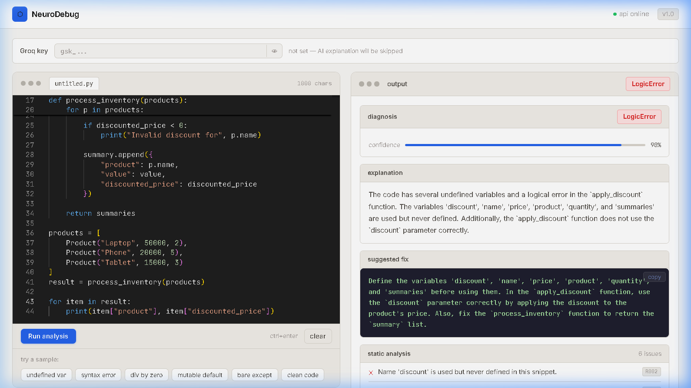

# NeuroDebug

A Python code debugger that combines static AST analysis with Groq LLM explanations.
Paste code, get a diagnosis. No code is ever executed — analysis only.



---

## How it works

```
your code
    ↓
AST parser (parser.py)
    ↓
Rule engine — 13 checks (rules.py)
    ↓
Groq LLM explanation using your own Groq API key (llm_engine.py)
    ↓
merged result → frontend
```

**Symbolic layer** catches things like undefined variables, division by zero, bare excepts, and mutable defaults — deterministically, without touching an LLM.

**Neural layer** sends the code + symbolic findings to Groq and gets back a plain-English explanation and a corrected code snippet.

---

## Project structure

```
neurodebug/
├── backend/
│   ├── main.py           # FastAPI app — POST /debug
│   ├── parser.py         # AST analysis
│   ├── rules.py          # 13 static rules (R001–R013)
│   ├── llm_engine.py     # Groq LLM integration
│   ├── utils.py          # merge symbolic + neural results
│   ├── tests/
│   │   └── test_debug.py
│   ├── requirements.txt
│   ├── Dockerfile
│   ├── .env              # your API key goes here
│   └── .env.example
│
├── frontend/
│   ├── src/
│   │   ├── App.jsx       # editor + key input + results
│   │   ├── main.jsx
│   │   └── index.css
│   ├── nginx.conf
│   ├── Dockerfile
│   ├── package.json
│   └── vite.config.js
│
├── docker-compose.yml
├── .gitignore
└── README.md
```

---

## API key — how it works

Each user enters their **own** Groq API key in the UI. It is:

- stored in their browser's `localStorage` (never sent to the server except per-request)
- sent as `api_key` in the POST body when they click "Run analysis"
- used to create a per-request Groq client — so **their account pays, not yours**

If no user key is provided, the backend falls back to the `GROQ_API_KEY` in `.env` (if set). If neither is set, the symbolic layer still runs — only the Groq explanation is skipped.

---

## Static rules

| Rule | Category | Severity |
|------|----------|----------|
| R001 | SyntaxError | error |
| R002 | UndefinedVariable | error |
| R003 | ReturnOutsideFunction | error |
| R004 | BareExcept | warning |
| R005 | MutableDefaultArgument | warning |
| R006 | DivisionByZero | error |
| R007 | InfiniteLoop | warning |
| R008 | Python2Print | warning |
| R009 | NoneComparison | warning |
| R010 | BoolComparison | warning |
| R011 | ShadowedBuiltin | warning |
| R012 | SilentException | warning |
| R013 | UnusedImport | info |

---

## Running locally

### Requirements
- Python 3.10+
- Node.js 18+

### Backend

```bash
cd backend

python -m venv venv
venv\Scripts\activate        # Windows
# source venv/bin/activate   # Mac/Linux

pip install -r requirements.txt

# optional — only needed if you want a server-side fallback key
cp .env.example .env
# edit .env and set GROQ_API_KEY=gsk-...

uvicorn main:app --reload --port 8000
```

API: `http://localhost:8000`
Swagger docs: `http://localhost:8000/docs`

### Frontend

```bash
cd frontend
npm install
npm run dev
```

App: `http://localhost:3000`

### Tests

```bash
cd backend
pip install pytest
pytest tests/ -v
```

---

## Docker

```bash
# make sure backend/.env has GROQ_API_KEY (optional — users can supply their own)
docker-compose up --build
```

- Frontend → `http://localhost:3000`
- Backend  → `http://localhost:8000`

---

## API reference

### `POST /debug`

```json
// request
{
  "code": "x = undefined_var\nprint(x)",
  "api_key": "sk-..."   // optional — user's own key
}

// response
{
  "error_type": "UndefinedVariable",
  "explanation": "The name 'undefined_var' is used on line 1 but was never defined...",
  "suggested_fix": "x = 'some value'\nprint(x)",
  "confidence_score": 0.93,
  "symbolic_issues": [
    {
      "rule_id": "R002",
      "severity": "error",
      "category": "UndefinedVariable",
      "message": "Name 'undefined_var' is used but never defined in this snippet.",
      "line": null
    }
  ],
  "raw_errors": ["[R002] Name 'undefined_var' is used but never defined in this snippet."]
}
```

### `GET /health`

```json
{ "status": "healthy", "service": "NeuroDebug API", "version": "1.0.0" }
```

---

## Deploying to AWS EC2

### 1. Launch instance

- AMI: Ubuntu 22.04 LTS
- Type: t2.medium (or t2.micro for free tier)
- Security group inbound rules:

  | Port | Source | Purpose |
  |------|--------|---------|
  | 22   | your IP | SSH |
  | 3000 | 0.0.0.0/0 | Frontend |
  | 8000 | 0.0.0.0/0 | Backend API |

### 2. SSH in

```bash
chmod 400 your-key.pem
ssh -i your-key.pem ubuntu@<EC2_PUBLIC_IP>
```

### 3. Install Docker

```bash
sudo apt-get update -y
sudo apt-get install -y docker.io

sudo curl -L \
  "https://github.com/docker/compose/releases/download/v2.24.0/docker-compose-$(uname -s)-$(uname -m)" \
  -o /usr/local/bin/docker-compose
sudo chmod +x /usr/local/bin/docker-compose

sudo usermod -aG docker ubuntu
newgrp docker
```

### 4. Clone and configure

```bash
git clone https://github.com/your-username/neurodebug.git
cd neurodebug

# optional server-side fallback key
cat > backend/.env << EOF
GROQ_API_KEY=gsk-...
EOF
```

### 5. Run

```bash
docker-compose up --build -d

# check status
docker-compose ps

# view logs
docker-compose logs -f
```

### 6. Access

```
http://<EC2_PUBLIC_IP>:3000   ← app
http://<EC2_PUBLIC_IP>:8000   ← API
```

### Useful commands

```bash
docker-compose down               # stop
docker-compose restart backend    # restart one service
docker-compose up --build -d      # rebuild after code changes
docker exec -it neurodebug_backend bash   # shell into backend
```

---

## Tech

| | |
|-|--|
| Backend | FastAPI + Uvicorn |
| Analysis | Python `ast` module |
| AI | Groq Llama 3 |
| Frontend | React 18 + Vite |
| Editor | Monaco Editor |
| Serving | nginx |
| Containers | Docker + Docker Compose |
| Deployment | AWS EC2 (Ubuntu 22.04) |

---


---

## License

MIT
