<div align="center">

# NeuroDebug

**Neuro-Symbolic AI Code Debugger**

[](https://www.python.org/)
[](https://fastapi.tiangolo.com/)
[](https://react.dev/)
[](https://www.docker.com/)
[](https://github.com/features/actions)
[](LICENSE)
[](https://github.com/joshi-chinmay-016/NeuroDebug/commits/main)
[](https://github.com/joshi-chinmay-016/NeuroDebug/stargazers)
[](https://github.com/joshi-chinmay-016/NeuroDebug/issues)
[](https://github.com/joshi-chinmay-016/NeuroDebug/pulls)

**A production-grade AI-powered debugging platform that combines static AST analysis with dynamic execution verification**

[Live Demo](https://neuro-debug.vercel.app) • [Documentation](#documentation) • [Architecture](#system-architecture) • [Roadmap](#project-roadmap) • [Report Bug](https://github.com/joshi-chinmay-016/NeuroDebug/issues) • [Request Feature](https://github.com/joshi-chinmay-016/NeuroDebug/issues)

</div>

---

## Product Overview

NeuroDebug solves the fundamental problem of automated code debugging by combining the reliability of static analysis with the intelligence of large language models. Traditional debuggers either rely on static rule-based systems that miss complex errors, or purely LLM-based approaches that can hallucinate fixes without verification.

### Why Existing Debuggers Are Insufficient

- **Static Analysis Tools**: Fast but limited to predefined patterns, miss context-dependent bugs
- **Pure LLM Solutions**: Generate plausible but unverified fixes that may introduce new issues
- **Traditional Debuggers**: Require manual execution and breakpoint management, not automated

### Why NeuroDebug Exists

NeuroDebug introduces a neuro-symbolic approach that merges deterministic AST analysis with neural LLM reasoning, then validates every candidate patch through actual execution. This hybrid architecture ensures:

- **Deterministic Detection**: 13 static rules catch common Python errors with zero false positives
- **Contextual Understanding**: LLM analysis provides nuanced explanations for complex issues
- **Verified Fixes**: Every candidate patch is executed and tested before presentation
- **Structured Evidence**: Complete execution reports with stdout, stderr, and test results

---

## Key Features

| Feature | Description |
|---------|-------------|
| **Neuro-Symbolic Analysis** | Combines AST parsing with 13 deterministic rules for static error detection |
| **Candidate Patch Generation** | LLM-powered fix generation with syntax validation and diff visualization |
| **Execution Verification** | Isolated subprocess execution validates patches before presentation |
| **AST Rule Engine** | 13 static rules (R001-R013) covering syntax, undefined variables, anti-patterns |
| **Unified Diff Viewer** | Monaco Editor integration with syntax highlighting and side-by-side diff |
| **Secure Verification Pipeline** | Timeout-protected execution with structured evidence collection |
| **Structured Logging** | Request-scoped logging with pipeline stage timing and error tracking |
| **Modern UI** | React 19 with responsive design, dark/light themes, and smooth animations |
| **GitHub Actions CI** | Automated linting, formatting, and testing on every push |
| **Firebase Integration** | Persistent debug session history with cloud synchronization |

---

## Demo

### Screenshots

*Future screenshots will be placed in the `screenshots/` directory:*

- **Landing Page**: `screenshots/landing-page.png`
- **Editor Interface**: `screenshots/editor-interface.png`
- **Patch View**: `screenshots/patch-view.png`
- **Diff View**: `screenshots/diff-view.png`
- **Verification Panel**: `screenshots/verification-panel.png`
- **Execution Timeline**: `screenshots/execution-timeline.png`
- **Settings**: `screenshots/settings.png`

---

## System Architecture

### Overall Architecture

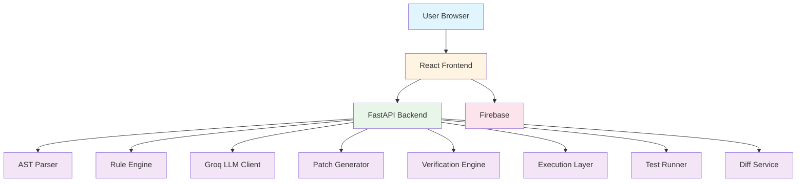
```mermaid
graph TD
    A[User Browser] --> B[React Frontend]
    B --> C[FastAPI Backend]
    C --> D[AST Parser]
    C --> E[Rule Engine]
    C --> F[Groq LLM Client]
    C --> G[Patch Generator]
    C --> H[Verification Engine]
    C --> I[Execution Layer]
    C --> J[Test Runner]
    C --> K[Diff Service]
    B --> L[Firebase]
    
    style A fill:#e1f5ff
    style B fill:#fff4e1
    style C fill:#e8f5e9
    style D fill:#f3e5f5
    style E fill:#f3e5f5
    style F fill:#f3e5f5
    style G fill:#f3e5f5
    style H fill:#f3e5f5
    style I fill:#f3e5f5
    style J fill:#f3e5f5
    style K fill:#f3e5f5
    style L fill:#fce4ec
```

### Frontend Architecture

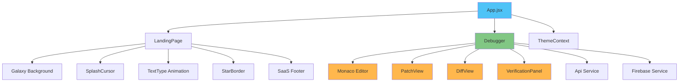
```mermaid
graph TD
    A[App.jsx] --> B[LandingPage]
    A --> C[Debugger]
    A --> D[ThemeContext]
    
    C --> E[Monaco Editor]
    C --> F[PatchView]
    C --> G[DiffView]
    C --> H[VerificationPanel]
    C --> I[Api Service]
    C --> J[Firebase Service]
    
    B --> K[Galaxy Background]
    B --> L[SplashCursor]
    B --> M[TextType Animation]
    B --> N[StarBorder]
    B --> O[SaaS Footer]
    
    style A fill:#4fc3f7
    style C fill:#81c784
    style E fill:#ffb74d
    style F fill:#ffb74d
    style G fill:#ffb74d
    style H fill:#ffb74d
```

### Backend Architecture

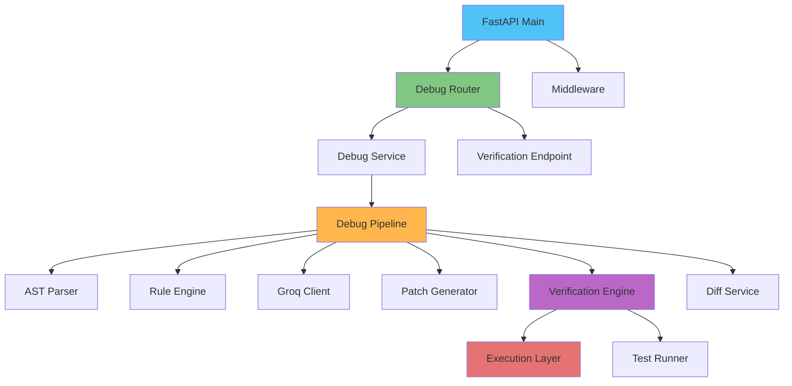
```mermaid
graph TD
    A[FastAPI Main] --> B[Debug Router]
    A --> C[Middleware]
    
    B --> D[Debug Service]
    B --> E[Verification Endpoint]
    
    D --> F[Debug Pipeline]
    F --> G[AST Parser]
    F --> H[Rule Engine]
    F --> I[Groq Client]
    F --> J[Patch Generator]
    F --> K[Verification Engine]
    
    K --> L[Execution Layer]
    K --> M[Test Runner]
    
    F --> N[Diff Service]
    
    style A fill:#4fc3f7
    style B fill:#81c784
    style F fill:#ffb74d
    style K fill:#ba68c8
    style L fill:#e57373
```

### Verification Pipeline

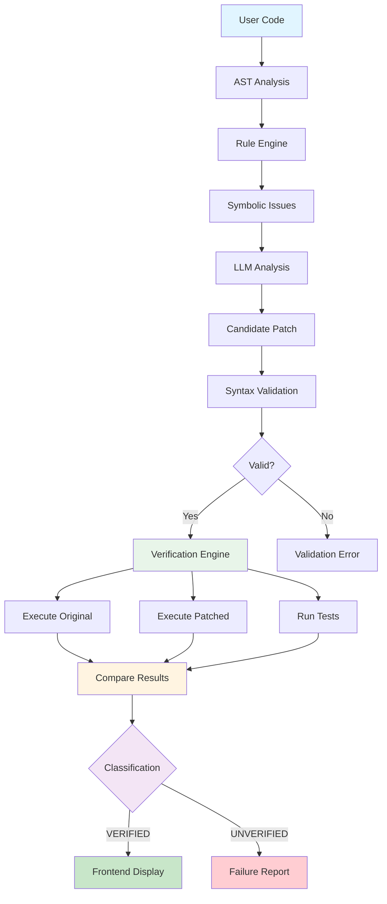
```mermaid
graph TD
    A[User Code] --> B[AST Analysis]
    B --> C[Rule Engine]
    C --> D[Symbolic Issues]
    D --> E[LLM Analysis]
    E --> F[Candidate Patch]
    F --> G[Syntax Validation]
    G --> H{Valid?}
    H -->|Yes| I[Verification Engine]
    H -->|No| J[Validation Error]
    I --> K[Execute Original]
    I --> L[Execute Patched]
    I --> M[Run Tests]
    K --> N[Compare Results]
    L --> N
    M --> N
    N --> O{Classification}
    O -->|VERIFIED| P[Frontend Display]
    O -->|UNVERIFIED| Q[Failure Report]
    
    style A fill:#e1f5ff
    style I fill:#e8f5e9
    style N fill:#fff4e1
    style O fill:#f3e5f5
    style P fill:#c8e6c9
    style Q fill:#ffcdd2
```

### Request Lifecycle

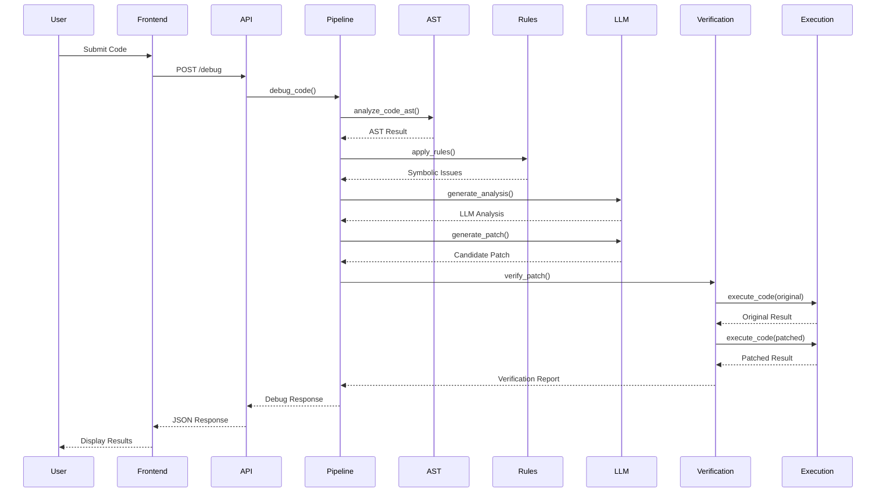
```mermaid
sequenceDiagram
    participant User
    participant Frontend
    participant API
    participant Pipeline
    participant AST
    participant Rules
    participant LLM
    participant Verification
    participant Execution
    
    User->>Frontend: Submit Code
    Frontend->>API: POST /debug
    API->>Pipeline: debug_code()
    Pipeline->>AST: analyze_code_ast()
    AST-->>Pipeline: AST Result
    Pipeline->>Rules: apply_rules()
    Rules-->>Pipeline: Symbolic Issues
    Pipeline->>LLM: generate_analysis()
    LLM-->>Pipeline: LLM Analysis
    Pipeline->>LLM: generate_patch()
    LLM-->>Pipeline: Candidate Patch
    Pipeline->>Verification: verify_patch()
    Verification->>Execution: execute_code(original)
    Execution-->>Verification: Original Result
    Verification->>Execution: execute_code(patched)
    Execution-->>Verification: Patched Result
    Verification-->>Pipeline: Verification Report
    Pipeline-->>API: Debug Response
    API-->>Frontend: JSON Response
    Frontend-->>User: Display Results
```

### Component Interaction

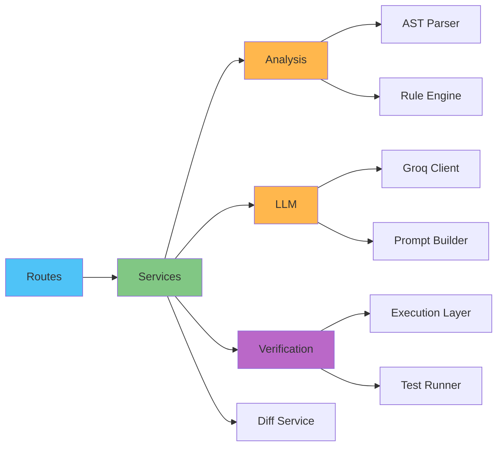
```mermaid
graph LR
    A[Routes] --> B[Services]
    B --> C[Analysis]
    B --> D[LLM]
    B --> E[Verification]
    C --> F[AST Parser]
    C --> G[Rule Engine]
    D --> H[Groq Client]
    D --> I[Prompt Builder]
    E --> J[Execution Layer]
    E --> K[Test Runner]
    B --> L[Diff Service]
    
    style A fill:#4fc3f7
    style B fill:#81c784
    style C fill:#ffb74d
    style D fill:#ffb74d
    style E fill:#ba68c8
```

### Module Dependency Graph

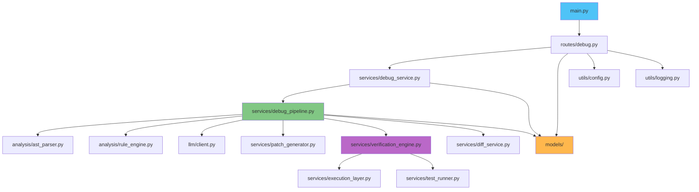
```mermaid
graph TD
    A[main.py] --> B[routes/debug.py]
    B --> C[services/debug_service.py]
    C --> D[services/debug_pipeline.py]
    D --> E[analysis/ast_parser.py]
    D --> F[analysis/rule_engine.py]
    D --> G[llm/client.py]
    D --> H[services/patch_generator.py]
    D --> I[services/verification_engine.py]
    I --> J[services/execution_layer.py]
    I --> K[services/test_runner.py]
    D --> L[services/diff_service.py]
    B --> M[models/]
    C --> M
    D --> M
    B --> N[utils/config.py]
    B --> O[utils/logging.py]
    
    style A fill:#4fc3f7
    style D fill:#81c784
    style I fill:#ba68c8
    style M fill:#ffb74d
```

### Deployment Architecture

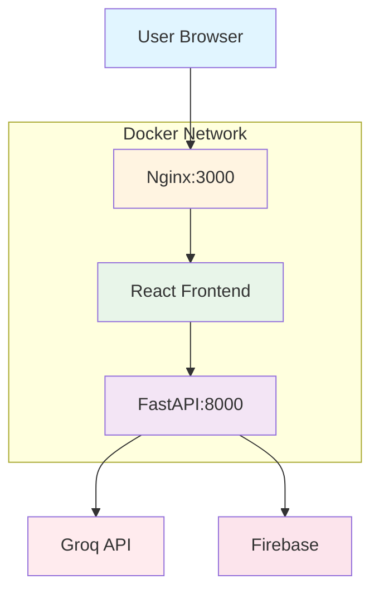
```mermaid
graph TD
    A[User Browser] --> B[Nginx:3000]
    B --> C[React Frontend]
    C --> D[FastAPI:8000]
    D --> E[Groq API]
    D --> F[Firebase]
    
    subgraph Docker Network
        B
        C
        D
    end
    
    style A fill:#e1f5ff
    style B fill:#fff4e1
    style C fill:#e8f5e9
    style D fill:#f3e5f5
    style E fill:#ffebee
    style F fill:#fce4ec
```

---

## Verification Pipeline

The verification pipeline is the core innovation of NeuroDebug, ensuring that every suggested fix is actually executed and validated.

### Pipeline Flow

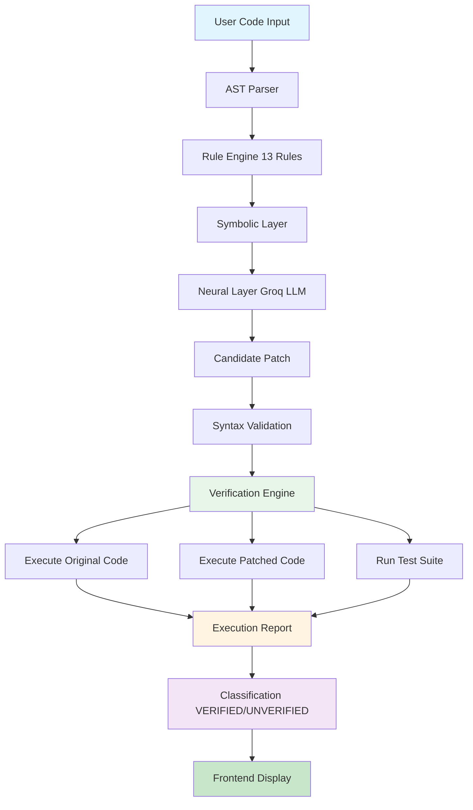
```mermaid
graph TD
    A[User Code Input] --> B[AST Parser]
    B --> C[Rule Engine 13 Rules]
    C --> D[Symbolic Layer]
    D --> E[Neural Layer Groq LLM]
    E --> F[Candidate Patch]
    F --> G[Syntax Validation]
    G --> H[Verification Engine]
    H --> I[Execute Original Code]
    H --> J[Execute Patched Code]
    H --> K[Run Test Suite]
    I --> L[Execution Report]
    J --> L
    K --> L
    L --> M[Classification VERIFIED/UNVERIFIED]
    M --> N[Frontend Display]
    
    style A fill:#e1f5ff
    style H fill:#e8f5e9
    style L fill:#fff4e1
    style M fill:#f3e5f5
    style N fill:#c8e6c9
```

### Verification Flow Diagram

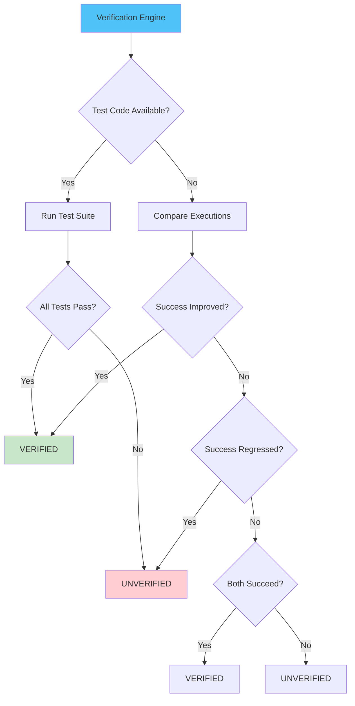
```mermaid
graph TD
    A[Verification Engine] --> B{Test Code Available?}
    B -->|Yes| C[Run Test Suite]
    B -->|No| D[Compare Executions]
    C --> E{All Tests Pass?}
    E -->|Yes| F[VERIFIED]
    E -->|No| G[UNVERIFIED]
    D --> H{Success Improved?}
    H -->|Yes| F
    H -->|No| I{Success Regressed?}
    I -->|Yes| G
    I -->|No| J{Both Succeed?}
    J -->|Yes| K[VERIFIED]
    J -->|No| L[UNVERIFIED]
    
    style A fill:#4fc3f7
    style F fill:#c8e6c9
    style G fill:#ffcdd2
```

---

## Folder Structure

```
neurodebug/
├── backend/                      # FastAPI backend service
│   ├── analysis/                  # Static analysis modules
│   │   ├── __init__.py
│   │   ├── ast_parser.py         # AST parsing and analysis
│   │   └── rule_engine.py        # 13 deterministic rules
│   ├── llm/                       # LLM integration
│   │   ├── __init__.py
│   │   ├── client.py             # Groq API client
│   │   └── prompt_builder.py     # LLM prompt construction
│   ├── models/                    # Pydantic models
│   │   ├── __init__.py
│   │   ├── errors.py             # Custom error classes
│   │   ├── requests.py           # API request models
│   │   └── responses.py          # API response models
│   ├── routes/                    # API route handlers
│   │   ├── __init__.py
│   │   └── debug.py              # Debug and verification endpoints
│   ├── services/                  # Business logic layer
│   │   ├── __init__.py
│   │   ├── debug_pipeline.py     # Main orchestration pipeline
│   │   ├── debug_service.py      # Debug service facade
│   │   ├── diff_service.py      # Unified diff generation
│   │   ├── execution_layer.py    # Isolated code execution
│   │   ├── patch_generator.py    # LLM-powered patch generation
│   │   ├── patch_validator.py    # Syntax validation
│   │   ├── test_runner.py        # Pytest test execution
│   │   └── verification_engine.py # Patch verification orchestration
│   ├── utils/                     # Utility modules
│   │   ├── __init__.py
│   │   ├── config.py             # Configuration management
│   │   └── logging.py            # Structured logging
│   ├── tests/                     # Backend test suite
│   │   ├── test_debug.py
│   │   ├── test_debug_service.py
│   │   ├── test_diff_service.py
│   │   ├── test_execution_layer.py
│   │   ├── test_patch_validator.py
│   │   ├── test_prompt_builder.py
│   │   └── test_verification_engine.py
│   ├── main.py                    # FastAPI application entry point
│   ├── llm_engine.py             # Legacy LLM integration
│   ├── parser.py                 # Legacy AST parser
│   ├── rules.py                  # Legacy rule definitions
│   ├── utils.py                  # Legacy utilities
│   ├── requirements.txt          # Python dependencies
│   ├── Dockerfile                 # Backend Docker image
│   ├── .env.example              # Environment variables template
│   └── .env                       # Local environment (gitignored)
│
├── frontend/                      # React frontend application
│   ├── src/
│   │   ├── components/           # React components
│   │   │   ├── LandingPage.jsx   # Landing page with animations
│   │   │   ├── Debugger.jsx      # Main debugger interface
│   │   │   ├── PatchView.jsx     # Patch display component
│   │   │   ├── DiffView.jsx      # Unified diff viewer
│   │   │   ├── VerificationPanel.jsx # Verification results
│   │   │   ├── Galaxy.jsx        # WebGL galaxy background
│   │   │   ├── SplashCursor.jsx  # Interactive cursor effects
│   │   │   ├── TextType.jsx      # Typing animation
│   │   │   ├── StarBorder.jsx    # Animated border effects
│   │   │   ├── BlurText.jsx      # Text reveal animation
│   │   │   ├── ThemeToggle.jsx   # Dark/light theme toggle
│   │   │   ├── GlareHover.jsx    # Hover glare effect
│   │   │   └── SaasFooter.jsx    # Professional footer
│   │   ├── contexts/              # React contexts
│   │   │   └── ThemeContext.jsx  # Theme management
│   │   ├── services/              # API services
│   │   │   ├── api.js            # Axios configuration
│   │   │   └── debugService.js   # Debug API calls
│   │   ├── config/                # Configuration
│   │   │   └── api.js            # API endpoints
│   │   ├── App.jsx               # Root application component
│   │   ├── main.jsx              # Application entry point
│   │   ├── firebase.js           # Firebase initialization
│   │   └── firebase-test.js      # Firebase test utilities
│   ├── public/                    # Static assets
│   ├── eslint.config.js          # ESLint configuration
│   ├── vite.config.js            # Vite build configuration
│   ├── package.json              # Node.js dependencies
│   ├── Dockerfile                 # Frontend Docker image
│   └── nginx.conf                 # Nginx configuration
│
├── .github/                       # GitHub configuration
│   └── workflows/
│       └── ci.yml                # GitHub Actions CI pipeline
│
├── screenshots/                    # Application screenshots
│   └── Screenshot 2026-06-30 153034.png
│
├── docker-compose.yml             # Multi-container orchestration
├── .gitignore                     # Git ignore rules
└── README.md                      # This file
```

---

## Technology Stack

### Frontend

| Technology | Purpose | Version |
|------------|---------|---------|
| React | UI Framework | 19.2.4 |
| Vite | Build Tool | 8.0.1 |
| Monaco Editor | Code Editor | 4.7.0 |
| React Router | Navigation | 7.14.2 |
| Axios | HTTP Client | 1.14.0 |
| Firebase | Backend Services | 12.12.1 |
| Framer Motion | Animations | 12.38.0 |
| GSAP | Advanced Animations | 3.15.0 |
| OGL | WebGL Graphics | 1.0.11 |
| ESLint | Linting | 9.39.4 |

### Backend

| Technology | Purpose | Version |
|------------|---------|---------|
| Python | Runtime | 3.10+ |
| FastAPI | Web Framework | 0.100+ |
| Pydantic | Data Validation | 2.0+ |
| Groq | LLM API | llama-3.1-8b-instant |
| Pytest | Testing Framework | Latest |
| Ruff | Linting | Latest |
| Black | Code Formatting | Latest |
| python-dotenv | Environment Variables | Latest |

### AI

| Component | Provider | Model |
|-----------|----------|-------|
| LLM Analysis | Groq | llama-3.1-8b-instant |
| Patch Generation | Groq | llama-3.1-8b-instant |
| Static Analysis | Custom | AST-based rules |

### Infrastructure

| Technology | Purpose |
|------------|---------|
| Docker | Containerization |
| Docker Compose | Multi-container orchestration |
| Nginx | Reverse proxy & static serving |
| GitHub Actions | CI/CD pipeline |

### Developer Tools

| Tool | Purpose |
|------|---------|
| Git | Version control |
| pytest | Unit testing |
| Ruff | Fast Python linter |
| Black | Python code formatter |
| ESLint | JavaScript/React linter |
| Vite | Fast dev server & bundler |

### Testing

| Tool | Coverage |
|------|----------|
| Pytest | Backend unit & integration tests |
| Execution Layer Tests | Subprocess isolation verification |
| Verification Engine Tests | Patch validation logic |
| Diff Service Tests | Unified diff generation |

### Deployment

| Platform | Purpose |
|----------|---------|
| Docker Compose | Local development |
| GitHub Actions | Automated testing |
| Nginx | Production reverse proxy |

---

## API Documentation

### Endpoints Overview

| Method | Route | Description |
|--------|-------|-------------|
| GET | `/` | API information |
| GET | `/health` | Health check |
| POST | `/debug` | Main debugging endpoint |
| POST | `/verify` | Patch verification endpoint |

### GET `/`

Root endpoint with API information.

**Response:**
```json
{
  "service": "NeuroDebug API",
  "version": "1.0.0",
  "status": "running",
  "docs": "/docs"
}
```

### GET `/health`

Health check endpoint for monitoring.

**Response:**
```json
{
  "status": "healthy",
  "service": "NeuroDebug API",
  "version": "1.0.0"
}
```

### POST `/debug`

Main debugging endpoint that orchestrates the complete analysis pipeline.

**Request:**
```json
{
  "code": "x = undefined_var\nprint(x)",
  "api_key": "gsk_..." 
}
```

**Parameters:**
- `code` (string, required): Python code to analyze
- `api_key` (string, optional): User's Groq API key

**Response:**
```json
{
  "detected_issues": [
    {
      "rule_id": "R002",
      "severity": "error",
      "category": "UndefinedVariable",
      "message": "Name 'undefined_var' is used but never defined",
      "line": null
    }
  ],
  "candidate_patch": {
    "original_code": "x = undefined_var\nprint(x)",
    "patched_code": "x = 'some value'\nprint(x)",
    "unified_diff": "--- a/original.py\n+++ b/patched.py\n@@ -1,2 +1,2 @@\n-x = undefined_var\n+x = 'some value'\n print(x)",
    "validation_passed": true,
    "validation_error": null
  },
  "error_type": "UndefinedVariable",
  "explanation": "The name 'undefined_var' is used on line 1 but was never defined",
  "confidence_score": 0.95,
  "patch_status": "generated",
  "validation_result": "valid",
  "verification_report": {
    "verification_status": "VERIFIED",
    "execution_summary": "Verification Status: VERIFIED\nOriginal Code: FAILED\nPatched Code: SUCCESS",
    "runtime": 1.234,
    "failure_reason": null,
    "evidence": {
      "original_code_execution": {
        "success": false,
        "exit_code": 1,
        "stdout": "",
        "stderr": "NameError: name 'undefined_var' is not defined",
        "execution_time": 0.001,
        "timeout_occurred": false,
        "traceback": null
      },
      "patched_code_execution": {
        "success": true,
        "exit_code": 0,
        "stdout": "some value\n",
        "stderr": "",
        "execution_time": 0.002,
        "timeout_occurred": false,
        "traceback": null
      },
      "test_results": null,
      "execution_comparison": {
        "original_success": false,
        "patched_success": true,
        "success_improved": true,
        "success_regressed": false
      }
    }
  },
  "metadata": {
    "ast_duration_ms": 15,
    "llm_duration_ms": 1250,
    "patch_generation_duration_ms": 890,
    "verification_duration_ms": 450
  }
}
```

**Error Codes:**
- `400`: Invalid input (empty code, exceeds max length)
- `422`: Analysis error
- `500`: Internal service error

### POST `/verify`

Verification endpoint for patch execution validation.

**Request:**
```json
{
  "original_code": "x = undefined_var\nprint(x)",
  "patched_code": "x = 'some value'\nprint(x)",
  "test_code": "def test_x_defined():\n    assert x == 'some value'"
}
```

**Parameters:**
- `original_code` (string, required): Original Python code
- `patched_code` (string, required): Candidate patch code
- `test_code` (string, optional): Pytest test code for verification

**Response:**
```json
{
  "verification_status": "VERIFIED",
  "execution_summary": "Verification Status: VERIFIED\nOriginal Code: FAILED\nPatched Code: SUCCESS\nTests: 1 passed, 0 failed",
  "runtime": 0.856,
  "failure_reason": null,
  "evidence": {
    "original_code_execution": {
      "success": false,
      "exit_code": 1,
      "stdout": "",
      "stderr": "NameError: name 'undefined_var' is not defined",
      "execution_time": 0.001,
      "timeout_occurred": false,
      "traceback": null
    },
    "patched_code_execution": {
      "success": true,
      "exit_code": 0,
      "stdout": "some value\n",
      "stderr": "",
      "execution_time": 0.002,
      "timeout_occurred": false,
      "traceback": null
    },
    "test_results": {
      "total_tests": 1,
      "passed": 1,
      "failed": 0,
      "skipped": 0,
      "duration": 0.5,
      "test_results": [
        {
          "test_name": "test_x_defined",
          "passed": true,
          "failed": false,
          "skipped": false,
          "duration": 0.1,
          "error_message": null
        }
      ],
      "output": "",
      "error": null
    },
    "execution_comparison": {
      "original_success": false,
      "patched_success": true,
      "success_improved": true,
      "success_regressed": false
    }
  }
}
```

**Error Codes:**
- `400`: Invalid input (empty code, exceeds max length)
- `500`: Internal verification error

---

## Installation

### Development Setup

#### Backend

```bash
cd backend

# Create virtual environment
python -m venv venv

# Activate virtual environment
# Windows:
venv\Scripts\activate
# Mac/Linux:
source venv/bin/activate

# Install dependencies
pip install -r requirements.txt

# Configure environment (optional)
cp .env.example .env
# Edit .env and set GROQ_API_KEY=gsk-...

# Start development server
uvicorn main:app --reload --port 8000
```

Backend API: `http://localhost:8000`  
Swagger Docs: `http://localhost:8000/docs`

#### Frontend

```bash
cd frontend

# Install dependencies
npm install

# Start development server
npm run dev
```

Frontend Application: `http://localhost:3000`

### Production Setup

#### Using Docker Compose

```bash
# Configure environment
cd backend
cp .env.example .env
# Edit .env with production values

# Build and start services
cd ..
docker-compose up --build -d
```

Services:
- Frontend: `http://localhost:3000`
- Backend: `http://localhost:8000`

#### Manual Production Deployment

**Backend:**
```bash
cd backend

# Install production dependencies
pip install -r requirements.txt

# Set environment variables
export GROQ_API_KEY="your-key"
export LOG_LEVEL="INFO"

# Start with production server
uvicorn main:app --host 0.0.0.0 --port 8000 --workers 4
```

**Frontend:**
```bash
cd frontend

# Install production dependencies
npm install

# Build for production
npm run build

# Serve with nginx or similar
# The build output is in dist/
```

### Environment Variables

| Variable | Description | Default | Required |
|----------|-------------|---------|----------|
| `GROQ_API_KEY` | Groq API key for LLM services | `None` | No* |
| `GROQ_MODEL` | Groq model to use | `llama-3.1-8b-instant` | No |
| `GROQ_BASE_URL` | Groq API base URL | `https://api.groq.com/openai/v1` | No |
| `LOG_LEVEL` | Logging level | `INFO` | No |
| `MAX_CODE_LENGTH` | Maximum code length for analysis | `10000` | No |
| `REQUEST_TIMEOUT` | Request timeout in seconds | `30` | No |

*Note: Users can provide their own API key via the API. The server-side key is optional fallback.

---

## Configuration

### Backend Configuration

Configuration is managed through `backend/utils/config.py` and environment variables.

**Groq API Configuration:**
- `GROQ_MODEL`: The Groq model used for analysis and patch generation
- `GROQ_BASE_URL`: API endpoint for Groq services
- `GROQ_API_KEY`: Server-side fallback API key (optional)

**Application Configuration:**
- `APP_NAME`: Application name for logging and API metadata
- `APP_VERSION`: Current application version
- `LOG_LEVEL`: Logging verbosity (DEBUG, INFO, WARNING, ERROR)

**API Configuration:**
- `MAX_CODE_LENGTH`: Maximum allowed code length in characters
- `REQUEST_TIMEOUT`: Default timeout for API requests

### Frontend Configuration

Frontend configuration is managed through `frontend/src/config/api.js`.

**API Endpoints:**
- Base URL configuration for backend API
- Timeout settings for API requests

**Firebase Configuration:**
- Firebase initialization in `frontend/src/firebase.js`
- Configuration requires your own Firebase project credentials

---

## Screenshots

### Placeholder Locations

Screenshots should be placed in the `screenshots/` directory with the following naming convention:

- `landing-page.png` - Main landing page with galaxy background
- `editor-interface.png` - Monaco editor with code input
- `patch-view.png` - Generated patch display with apply button
- `diff-view.png` - Side-by-side diff comparison
- `verification-panel.png` - Verification results and execution report
- `execution-timeline.png` - Pipeline execution timeline visualization
- `settings.png` - Settings and configuration panel

---

## Sequence Diagrams

### Debug Request Flow

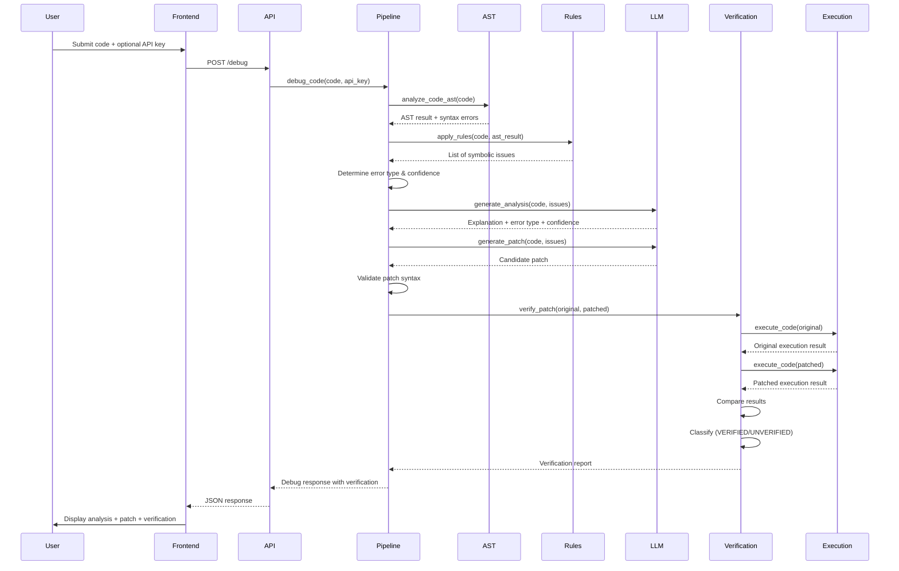
```mermaid
sequenceDiagram
    participant User
    participant Frontend
    participant API
    participant Pipeline
    participant AST
    participant Rules
    participant LLM
    participant Verification
    participant Execution
    
    User->>Frontend: Submit code + optional API key
    Frontend->>API: POST /debug
    API->>Pipeline: debug_code(code, api_key)
    Pipeline->>AST: analyze_code_ast(code)
    AST-->>Pipeline: AST result + syntax errors
    Pipeline->>Rules: apply_rules(code, ast_result)
    Rules-->>Pipeline: List of symbolic issues
    Pipeline->>Pipeline: Determine error type & confidence
    Pipeline->>LLM: generate_analysis(code, issues)
    LLM-->>Pipeline: Explanation + error type + confidence
    Pipeline->>LLM: generate_patch(code, issues)
    LLM-->>Pipeline: Candidate patch
    Pipeline->>Pipeline: Validate patch syntax
    Pipeline->>Verification: verify_patch(original, patched)
    Verification->>Execution: execute_code(original)
    Execution-->>Verification: Original execution result
    Verification->>Execution: execute_code(patched)
    Execution-->>Verification: Patched execution result
    Verification->>Verification: Compare results
    Verification->>Verification: Classify (VERIFIED/UNVERIFIED)
    Verification-->>Pipeline: Verification report
    Pipeline-->>API: Debug response with verification
    API-->>Frontend: JSON response
    Frontend->>User: Display analysis + patch + verification
```

### Verification Request Flow

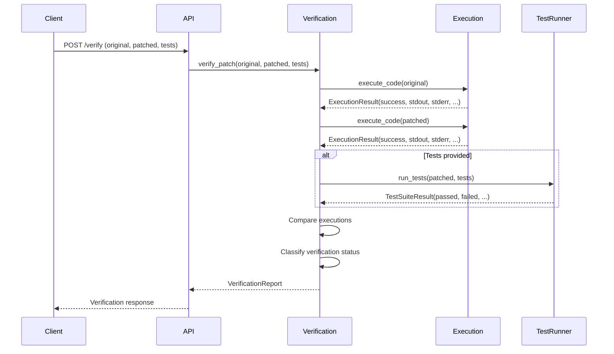
```mermaid
sequenceDiagram
    participant Client
    participant API
    participant Verification
    participant Execution
    participant TestRunner
    
    Client->>API: POST /verify (original, patched, tests)
    API->>Verification: verify_patch(original, patched, tests)
    Verification->>Execution: execute_code(original)
    Execution-->>Verification: ExecutionResult(success, stdout, stderr, ...)
    Verification->>Execution: execute_code(patched)
    Execution-->>Verification: ExecutionResult(success, stdout, stderr, ...)
    
    alt Tests provided
        Verification->>TestRunner: run_tests(patched, tests)
        TestRunner-->>Verification: TestSuiteResult(passed, failed, ...)
    end
    
    Verification->>Verification: Compare executions
    Verification->>Verification: Classify verification status
    Verification-->>API: VerificationReport
    API-->>Client: Verification response
```

---

## Request Lifecycle

### Complete Request Processing Pipeline

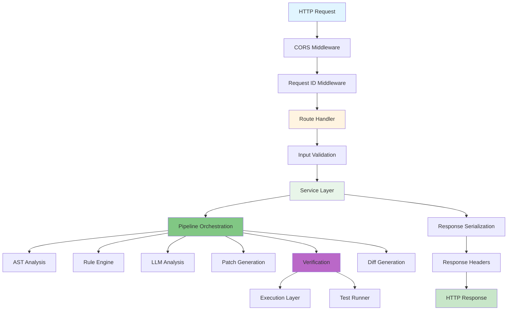
```mermaid
graph TD
    A[HTTP Request] --> B[CORS Middleware]
    B --> C[Request ID Middleware]
    C --> D[Route Handler]
    D --> E[Input Validation]
    E --> F[Service Layer]
    F --> G[Pipeline Orchestration]
    G --> H[AST Analysis]
    G --> I[Rule Engine]
    G --> J[LLM Analysis]
    G --> K[Patch Generation]
    G --> L[Verification]
    L --> M[Execution Layer]
    L --> N[Test Runner]
    G --> O[Diff Generation]
    F --> P[Response Serialization]
    P --> Q[Response Headers]
    Q --> R[HTTP Response]
    
    style A fill:#e1f5ff
    style D fill:#fff4e1
    style F fill:#e8f5e9
    style G fill:#81c784
    style L fill:#ba68c8
    style R fill:#c8e6c9
```

---

## Error Handling Flow

### Error Handling Architecture

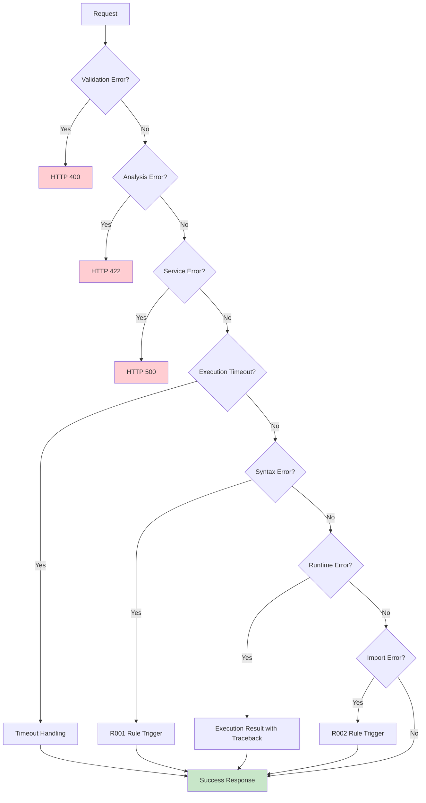
```mermaid
graph TD
    A[Request] --> B{Validation Error?}
    B -->|Yes| C[HTTP 400]
    B -->|No| D{Analysis Error?}
    D -->|Yes| E[HTTP 422]
    D -->|No| F{Service Error?}
    F -->|Yes| G[HTTP 500]
    F -->|No| H{Execution Timeout?}
    H -->|Yes| I[Timeout Handling]
    H -->|No| J{Syntax Error?}
    J -->|Yes| K[R001 Rule Trigger]
    J -->|No| L{Runtime Error?}
    L -->|Yes| M[Execution Result with Traceback]
    L -->|No| N{Import Error?}
    N -->|Yes| O[R002 Rule Trigger]
    N -->|No| P[Success Response]
    
    I --> P
    K --> P
    M --> P
    O --> P
    
    style C fill:#ffcdd2
    style E fill:#ffcdd2
    style G fill:#ffcdd2
    style P fill:#c8e6c9
```

### Specific Error Flows

**Timeout Handling:**
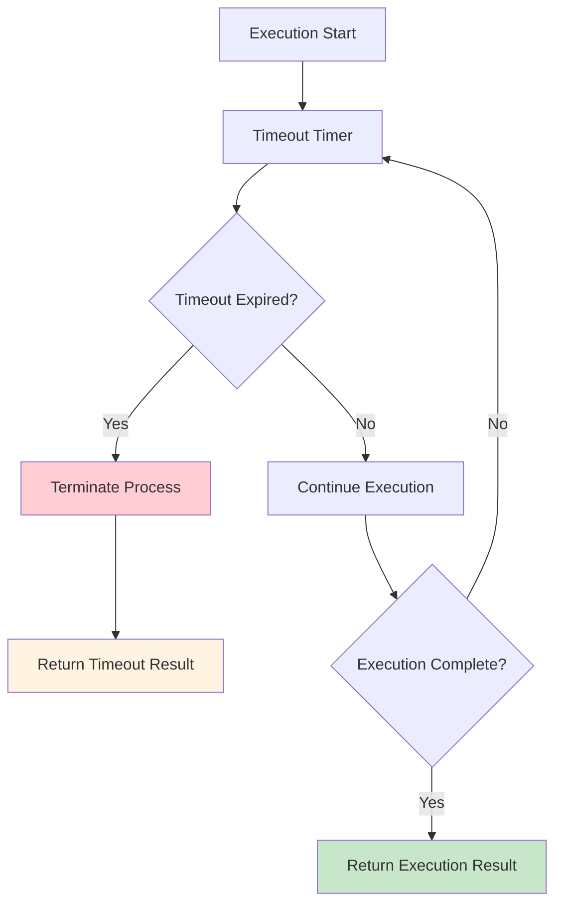
```mermaid
graph TD
    A[Execution Start] --> B[Timeout Timer]
    B --> C{Timeout Expired?}
    C -->|Yes| D[Terminate Process]
    C -->|No| E[Continue Execution]
    D --> F[Return Timeout Result]
    E --> G{Execution Complete?}
    G -->|Yes| H[Return Execution Result]
    G -->|No| B
    
    style D fill:#ffcdd2
    style F fill:#fff4e1
    style H fill:#c8e6c9
```

**Syntax Error Handling:**
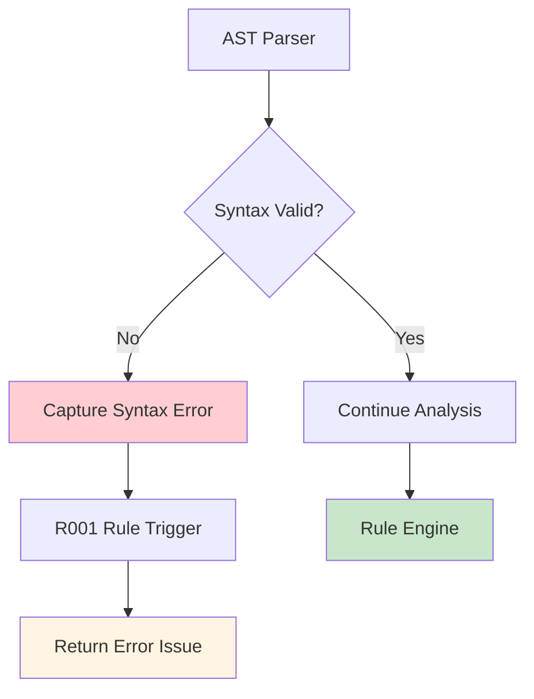
```mermaid
graph TD
    A[AST Parser] --> B{Syntax Valid?}
    B -->|No| C[Capture Syntax Error]
    B -->|Yes| D[Continue Analysis]
    C --> E[R001 Rule Trigger]
    E --> F[Return Error Issue]
    D --> G[Rule Engine]
    
    style C fill:#ffcdd2
    style F fill:#fff4e1
    style G fill:#c8e6c9
```

**Verification Failure:**
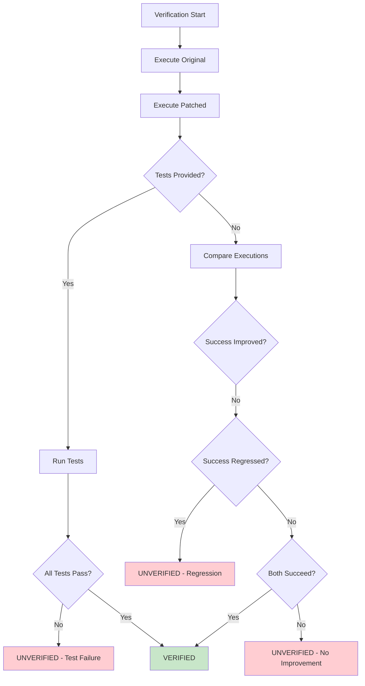
```mermaid
graph TD
    A[Verification Start] --> B[Execute Original]
    B --> C[Execute Patched]
    C --> D{Tests Provided?}
    D -->|Yes| E[Run Tests]
    D -->|No| F[Compare Executions]
    E --> G{All Tests Pass?}
    G -->|No| H[UNVERIFIED - Test Failure]
    G -->|Yes| I[VERIFIED]
    F --> J{Success Improved?}
    J -->|No| K{Success Regressed?}
    K -->|Yes| L[UNVERIFIED - Regression]
    K -->|No| M{Both Succeed?}
    M -->|No| N[UNVERIFIED - No Improvement]
    M -->|Yes| I
    
    style H fill:#ffcdd2
    style L fill:#ffcdd2
    style N fill:#ffcdd2
    style I fill:#c8e6c9
```

---

## Project Roadmap

### Week 1: Foundation
- [x] AST Parser implementation
- [x] Rule Engine with 13 static rules
- [x] Basic LLM integration with Groq
- [x] Candidate patch generation
- [x] Unified diff generation
- [x] Frontend Monaco Editor integration
- [x] Basic debugging UI

### Week 2: Verification Engine
- [x] Execution Layer with subprocess isolation
- [x] Verification Engine orchestration
- [x] Test Runner integration
- [x] Verification report generation
- [x] Patch classification (VERIFIED/UNVERIFIED)
- [x] Verification Panel UI component
- [x] Structured logging implementation

### Week 3: Enhanced Features
- [ ] Redis caching for LLM responses
- [ ] Docker sandbox for execution isolation
- [ ] Benchmark framework for performance
- [ ] Evaluation dataset for quality metrics
- [ ] Cost-aware caching strategy
- [ ] Developer analytics dashboard

### Week 4: Production Readiness
- [ ] Enhanced security hardening
- [ ] Rate limiting implementation
- [ ] Comprehensive test coverage
- [ ] Performance optimization
- [ ] Documentation completion
- [ ] Deployment automation

### Future Enhancements
- [ ] Multi-language support (JavaScript, TypeScript, Java)
- [ ] Custom rule engine for user-defined rules
- [ ] Integration with popular IDEs (VS Code, JetBrains)
- [ ] Team collaboration features
- [ ] Advanced analytics and insights
- [ ] Self-hosted deployment options

---

## Development Workflow

### Git Workflow

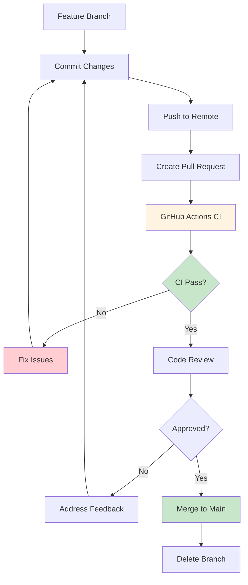
```mermaid
graph TD
    A[Feature Branch] --> B[Commit Changes]
    B --> C[Push to Remote]
    C --> D[Create Pull Request]
    D --> E[GitHub Actions CI]
    E --> F{CI Pass?}
    F -->|No| G[Fix Issues]
    G --> B
    F -->|Yes| H[Code Review]
    H --> I{Approved?}
    I -->|No| J[Address Feedback]
    J --> B
    I -->|Yes| K[Merge to Main]
    K --> L[Delete Branch]
    
    style E fill:#fff4e1
    style F fill:#c8e6c9
    style G fill:#ffcdd2
    style K fill:#c8e6c9
```

### Branch Naming Convention

- `feature/` - New features
- `bugfix/` - Bug fixes
- `hotfix/` - Critical production fixes
- `refactor/` - Code refactoring
- `docs/` - Documentation updates

### Commit Conventions

Follow conventional commits:
- `feat:` - New feature
- `fix:` - Bug fix
- `docs:` - Documentation changes
- `refactor:` - Code refactoring
- `test:` - Test additions/changes
- `chore:` - Maintenance tasks

---

## CI Pipeline

### GitHub Actions Workflow

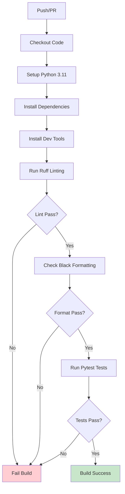
```mermaid
graph TD
    A[Push/PR] --> B[Checkout Code]
    B --> C[Setup Python 3.11]
    C --> D[Install Dependencies]
    D --> E[Install Dev Tools]
    E --> F[Run Ruff Linting]
    F --> G{Lint Pass?}
    G -->|No| H[Fail Build]
    G -->|Yes| I[Check Black Formatting]
    I --> J{Format Pass?}
    J -->|No| H
    J -->|Yes| K[Run Pytest Tests]
    K --> L{Tests Pass?}
    L -->|No| H
    L -->|Yes| M[Build Success]
    
    style H fill:#ffcdd2
    style M fill:#c8e6c9
```

### CI Configuration

**Workflow:** `.github/workflows/ci.yml`

**Triggers:**
- Push to `main`, `develop`, `ft/patch` branches
- Pull requests to `main`

**Steps:**
1. Checkout repository
2. Setup Python 3.11
3. Install dependencies
4. Install development tools (pytest, ruff, black)
5. Run Ruff linting
6. Check Black formatting
7. Run pytest tests

---

## Security

### Security Architecture

NeuroDebug implements multiple layers of security to ensure safe code execution:

**No Arbitrary Host Execution:**
- Code execution is isolated in temporary files
- Subprocess execution with timeout protection
- No direct shell access or command injection
- Maximum execution time limits (60s)

**Verification Isolation:**
- Each verification runs in isolated subprocess
- Temporary files are cleaned up after execution
- No shared state between executions
- Timeout protection prevents infinite loops

**Secret Management:**
- API keys are never logged or exposed
- User-provided keys are used per-request
- Server-side keys are optional fallback
- Environment variables for sensitive configuration

**Input Validation:**
- Maximum code length limits (10,000 characters)
- Request timeout enforcement (30s)
- Type validation with Pydantic models
- Sanitization of user inputs

**Secure Logging:**
- Request IDs for traceability without exposing data
- Structured logging with configurable levels
- No sensitive data in logs
- Execution outputs captured securely

---

## Performance

### Performance Metrics

Benchmarking will be introduced in a future release. Current performance characteristics:

- **AST Analysis**: Typically < 50ms for code snippets
- **Rule Engine**: < 10ms for 13 rules
- **LLM Analysis**: 500-2000ms depending on code complexity
- **Patch Generation**: 500-1500ms
- **Verification**: 100-500ms per execution
- **Total Pipeline**: 1-4 seconds typical

### Optimization Strategy

- AST parsing is cached within requests
- Rule engine is deterministic and fast
- LLM calls are the primary bottleneck
- Verification is parallelized where possible
- Future: Redis caching for repeated analyses

---

## Testing

### Test Strategy

**Unit Tests:**
- AST parser correctness
- Rule engine accuracy
- Execution layer isolation
- Diff generation accuracy
- Model validation

**Integration Tests:**
- Complete debug pipeline
- Verification orchestration
- API endpoint integration
- Service layer interactions

**Verification Tests:**
- Patch classification logic
- Execution comparison
- Test runner integration
- Timeout handling
- Error scenarios

### Test Coverage

Current test files:
- `test_debug.py` - Basic debug functionality
- `test_debug_service.py` - Service layer tests
- `test_diff_service.py` - Diff generation tests
- `test_execution_layer.py` - Execution isolation tests
- `test_patch_validator.py` - Validation logic tests
- `test_prompt_builder.py` - LLM prompt tests
- `test_verification_engine.py` - Verification orchestration tests

### Running Tests

```bash
cd backend

# Run all tests
pytest

# Run with coverage
pytest --cov=.

# Run specific test file
pytest tests/test_verification_engine.py -v

# Run with verbose output
pytest -v
```

---

## Code Quality

### Code Quality Tools

**Backend:**
- **Ruff**: Fast Python linter for code quality
- **Black**: Opinionated code formatter for consistency
- **Pytest**: Testing framework with fixtures
- **Pydantic**: Data validation with type hints
- **Type Hints**: Full type annotation coverage

**Frontend:**
- **ESLint**: JavaScript/React linting
- **React Hooks**: Strict mode for hook usage
- **Prettier**: Code formatting (planned)

### Quality Standards

- All functions have docstrings
- Type hints on all function signatures
- Pydantic models for API contracts
- Structured logging throughout
- Error handling with custom exceptions
- Test coverage for critical paths

### CI Enforcement

- Ruff must pass without errors
- Black formatting must be check-passed
- All tests must pass before merge
- Pull requests require review

---

## Contributing

### Contribution Guidelines

**Branch Naming:**
- Use descriptive branch names: `feature/verification-engine`, `bugfix/timeout-handling`

**Commit Messages:**
- Follow conventional commit format
- Include issue references when applicable
- Keep messages concise but descriptive

**Pull Request Process:**
1. Create feature branch from `main`
2. Make changes with clear commits
3. Ensure all tests pass locally
4. Create pull request with description
5. Address review feedback
6. Maintain clean commit history

**Review Expectations:**
- Code must pass CI checks
- New features require tests
- Documentation updates for API changes
- Security review for sensitive changes

**Development Setup:**
```bash
# Fork and clone repository
git clone https://github.com/your-username/NeuroDebug.git

# Create feature branch
git checkout -b feature/your-feature-name

# Make changes and test
# Run tests: pytest
# Run linting: ruff check .
# Run formatting: black .

# Commit and push
git add .
git commit -m "feat: add your feature"
git push origin feature/your-feature-name

# Create pull request
```

---

## Known Limitations

### Current Limitations

**Language Support:**
- Only Python code is currently supported
- AST-based analysis is Python-specific
- Rule engine is designed for Python patterns

**Execution Environment:**
- Subprocess isolation (not full containerization)
- Limited to single-file execution
- No external dependency installation
- File system access is restricted

**LLM Dependency:**
- Requires Groq API key for full functionality
- LLM responses can be non-deterministic
- Rate limits may affect availability
- Quality depends on model performance

**Verification:**
- Test generation is not yet automated
- Limited to pytest-compatible tests
- No integration testing support
- Performance testing not yet implemented

**Scalability:**
- No horizontal scaling support
- No request queuing system
- Limited concurrent request handling
- No caching layer (planned)

### Planned Improvements

See [Project Roadmap](#project-roadmap) for planned enhancements.

---

## Future Vision

### Engineering Milestones

**Redis Caching:**
- Cache LLM responses for repeated code
- Cache AST analysis results
- Implement TTL-based invalidation
- Reduce API costs and latency

**Docker Sandbox:**
- Replace subprocess isolation with containers
- Enhanced security and isolation
- Support for external dependencies
- Better resource management

**Benchmark Framework:**
- Standardized performance benchmarks
- Regression testing for performance
- Historical performance tracking
- Optimization identification

**Evaluation Dataset:**
- Curated dataset of Python bugs
- Ground truth for evaluation
- Automated quality metrics
- Model comparison capabilities

**Cost-Aware Caching:**
- Track API usage and costs
- Intelligent cache eviction
- Cost optimization strategies
- Usage analytics dashboard

**Developer Analytics:**
- Track common error patterns
- Identify frequent issues
- Suggest rule improvements
- Product usage insights

---

## License

This project is licensed under the MIT License - see the [LICENSE](LICENSE) file for details.

---

## Acknowledgements

### Open Source Libraries

**Backend:**
- [FastAPI](https://fastapi.tiangolo.com/) - Modern, fast web framework
- [Pydantic](https://docs.pydantic.dev/) - Data validation using Python type annotations
- [Groq](https://groq.com/) - Fast LLM inference API
- [pytest](https://docs.pytest.org/) - Testing framework
- [Ruff](https://github.com/astral-sh/ruff) - Fast Python linter
- [Black](https://github.com/psf/black) - Python code formatter

**Frontend:**
- [React](https://react.dev/) - UI library
- [Vite](https://vitejs.dev/) - Build tool and dev server
- [Monaco Editor](https://microsoft.github.io/monaco-editor/) - Code editor component
- [Framer Motion](https://www.framer.com/motion/) - Animation library
- [GSAP](https://greensock.com/gsap/) - Professional animation library
- [OGL](https://ogjs.com/) - WebGL graphics library
- [Firebase](https://firebase.google.com/) - Backend services

**Development:**
- [Docker](https://www.docker.com/) - Containerization platform
- [GitHub Actions](https://github.com/features/actions) - CI/CD platform
- [Nginx](https://nginx.org/) - High-performance web server

---

## Documentation

- [API Documentation](#api-documentation)
- [Architecture](#system-architecture)
- [Installation](#installation)
- [Configuration](#configuration)
- [Contributing](#contributing)
- [Security](#security)

---

<div align="center">

**Built with ❤️ for developers who ship better code**

[Back to Top](#neurodebug)

</div>
