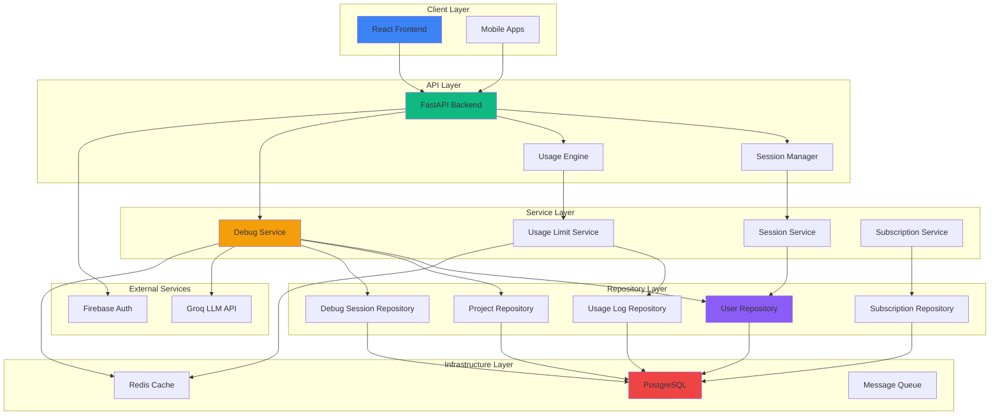
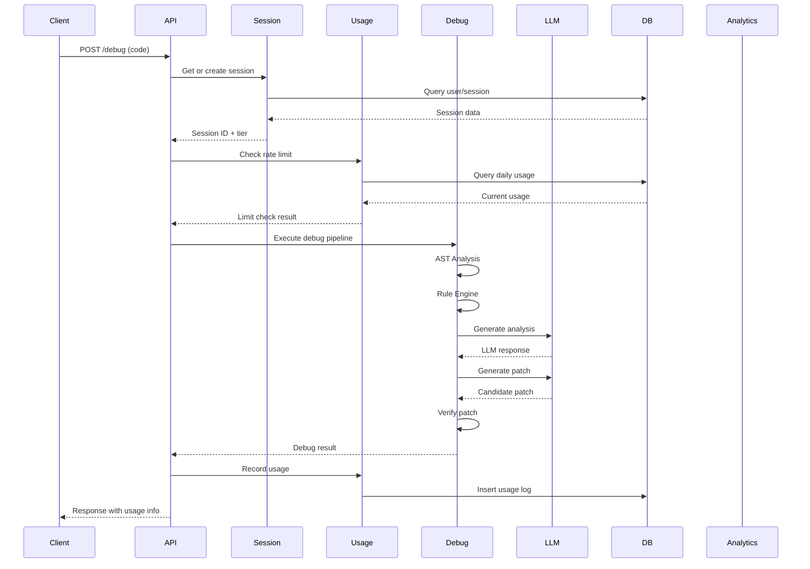
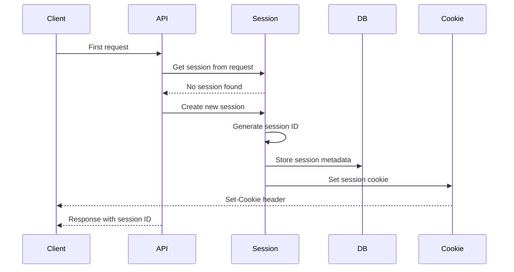
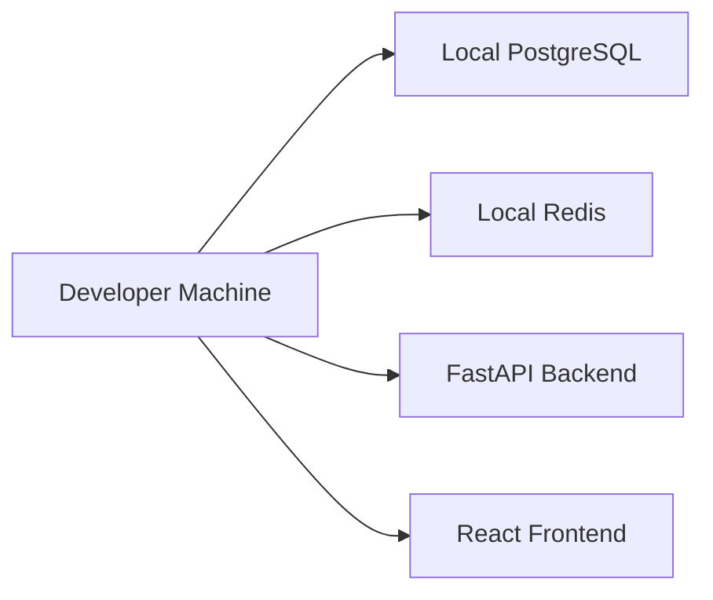

# Architecture Documentation

## System Overview

NeuroDebug is a production-grade AI-powered debugging platform built with a clean, microservices-ready architecture. The system combines static AST analysis with dynamic LLM reasoning, then validates every candidate patch through actual execution.

## High-Level Architecture



## Layered Architecture

### Client Layer

**React Frontend** - Modern, responsive UI built with React 19, featuring:
- Premium design system with Tailwind CSS
- Monaco Editor for code editing
- Real-time updates via WebSocket
- Progressive Web App capabilities
- 3D visualizations with React Three Fiber

### API Layer

**FastAPI Backend** - High-performance async API:
- RESTful endpoints with OpenAPI documentation
- Request/response validation with Pydantic
- CORS and security middleware
- Request ID tracking
- Structured logging

**Session Manager** - Handles authentication and sessions:
- Anonymous guest sessions
- Authenticated user sessions
- Session-based rate limiting
- Cookie-based session persistence

**Usage Engine** - Enforces subscription limits:
- Configurable tier-based limits
- Real-time usage tracking
- Analytics aggregation
- Upgrade prompts

### Service Layer

**Debug Service** - Core debugging orchestration:
- AST analysis pipeline
- Rule engine execution
- LLM integration
- Patch generation
- Verification orchestration

**Session Service** - Session management:
- Session creation and validation
- User authentication
- Session upgrades
- Usage tracking

**Usage Limit Service** - Subscription enforcement:
- Limit checking
- Usage recording
- Analytics generation
- Tier management

**Subscription Service** - Subscription management:
- Plan management
- User subscriptions
- Limit configuration
- Billing integration (future)

### Repository Layer

**Repository Pattern** - Data access abstraction:
- Base repository with CRUD operations
- Domain-specific repositories
- Async database operations
- Transaction management
- Soft delete support

### Infrastructure Layer

**PostgreSQL** - Primary database:
- Normalized relational schema
- UUID primary keys
- Comprehensive indexing
- Soft delete support
- Connection pooling

**Redis Cache** - Caching layer (future):
- Session caching
- Rate limit caching
- Result caching
- Pub/Sub for real-time updates

**Message Queue** - Async processing (future):
- Background job processing
- Analytics aggregation
- Email notifications
- Webhook delivery

## Request Flow

### Debug Request Flow



### Session Creation Flow



## Design Patterns

### Repository Pattern

All data access goes through repository classes that encapsulate database operations:

```python
class UserRepository(BaseRepository[User, Any, Any]):
    async def get_by_email(self, email: str) -> User | None:
        # Implementation
```

### Service Layer Pattern

Business logic is encapsulated in service classes:

```python
class DebugService:
    async def debug_code(self, code: str, api_key: str | None) -> DebugResponse:
        # Orchestrate debug pipeline
```

### Dependency Injection

Services receive dependencies via constructor injection:

```python
class UsageLimitService:
    def __init__(
        self,
        session: AsyncSession,
        subscription_repo: SubscriptionRepository,
        usage_log_repo: UsageLogRepository,
    ):
        # Store dependencies
```

### Clean Architecture

The architecture follows clean architecture principles:

- **Domain Layer**: Business entities and logic
- **Application Layer**: Use cases and orchestration
- **Infrastructure Layer**: Database, external APIs
- **Interface Layer**: API endpoints, UI components

## Security Considerations

### Authentication

- Optional authentication (guest access supported)
- Firebase Auth integration (planned)
- Session-based authentication
- Secure cookie handling

### Authorization

- Subscription tier-based access control
- Rate limiting per tier
- Resource ownership validation
- API key authentication (future)

### Data Protection

- Soft delete for data retention
- UUID primary keys to prevent enumeration
- Input validation and sanitization
- SQL injection prevention via ORM
- XSS protection via React

## Performance Optimization

### Database

- Connection pooling
- Query optimization with indexes
- Read replicas (future)
- Caching layer (Redis)

### API

- Async I/O throughout
- Request caching where appropriate
- Pagination for large datasets
- Compression for responses

### Frontend

- Code splitting and lazy loading
- Component memoization
- Virtualization for large lists
- Image optimization
- CDN for static assets

## Scalability

### Horizontal Scaling

- Stateless API servers
- Database connection pooling
- Load balancer support
- Container orchestration ready

### Vertical Scaling

- Resource monitoring
- Performance profiling
- Query optimization
- Memory management

## Monitoring and Observability

### Logging

- Structured logging with JSON format
- Request-scoped logging
- Error tracking
- Performance metrics

### Metrics

- Request timing
- Error rates
- Usage analytics
- Resource utilization

### Tracing

- Request ID propagation
- Distributed tracing (future)
- Performance profiling
- Dependency mapping

## Deployment Architecture

### Development



### Production

```mermaid
graph TB
    subgraph "Load Balancer"
        LB[NGINX/Cloudflare]
    end

    subgraph "API Servers"
        API1[FastAPI 1]
        API2[FastAPI 2]
        API3[FastAPI N]
    end

    subgraph "Database Cluster"
        PG[PostgreSQL Primary]
        REPLICA1[PostgreSQL Replica 1]
        REPLICA2[PostgreSQL Replica 2]
    end

    subgraph "Cache Layer"
        REDIS[Redis Cluster]
    end

    subgraph "CDN"
        CDN[Cloudflare/CloudFront]
    end

    LB --> API1
    LB --> API2
    LB --> API3
    API1 --> PG
    API2 --> PG
    API3 --> PG
    API1 --> REDIS
    API2 --> REDIS
    API3 --> REDIS
    PG --> REPLICA1
    PG --> REPLICA2
    CDN --> LB
```

## Technology Stack

### Backend

- **Language**: Python 3.11+
- **Framework**: FastAPI
- **ORM**: SQLAlchemy 2.0
- **Database**: PostgreSQL 16
- **Cache**: Redis (planned)
- **Task Queue**: Celery (planned)

### Frontend

- **Framework**: React 19
- **Build Tool**: Vite
- **Styling**: Tailwind CSS
- **Editor**: Monaco Editor
- **3D**: React Three Fiber
- **Animations**: Framer Motion

### DevOps

- **Containerization**: Docker
- **Orchestration**: Docker Compose
- **CI/CD**: GitHub Actions
- **Monitoring**: Structured logging
- **Deployment**: Render/Vercel (planned)
