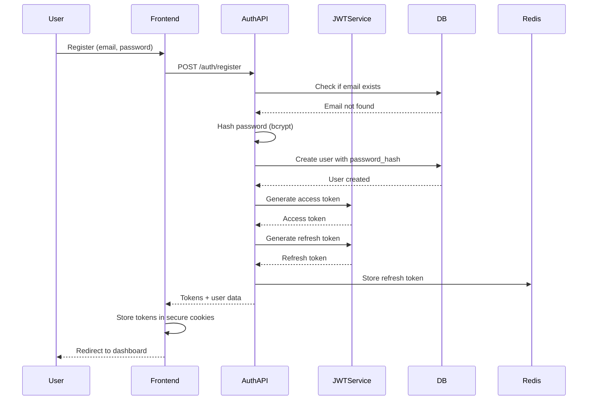

# Authentication Documentation

## Overview

NeuroDebug implements a production-ready JWT-based authentication system with secure session management, refresh tokens, and optional guest access.

## Architecture

### Authentication Flow



## Features

- **JWT Authentication**: Access tokens (15min expiry) and refresh tokens (7 days expiry)
- **Secure Password Hashing**: bcrypt with salt rounds
- **Session Persistence**: Secure HTTP-only cookies
- **Token Refresh**: Automatic token refresh mechanism
- **Rate Limiting**: Per-IP rate limiting on auth endpoints
- **CSRF Protection**: CSRF token validation for state-changing operations
- **Optional Authentication**: Guest users can debug without account creation

## API Endpoints

### Register

```http
POST /auth/register
Content-Type: application/json

{
  "email": "user@example.com",
  "password": "SecurePassword123!",
  "display_name": "John Doe"
}
```

**Response:**
```json
{
  "access_token": "eyJhbGciOiJIUzI1NiIsInR5cCI6IkpXVCJ9...",
  "refresh_token": "eyJhbGciOiJIUzI1NiIsInR5cCI6IkpXVCJ9...",
  "token_type": "bearer",
  "user": {
    "id": "uuid",
    "email": "user@example.com",
    "display_name": "John Doe"
  }
}
```

### Login

```http
POST /auth/login
Content-Type: application/json

{
  "email": "user@example.com",
  "password": "SecurePassword123!"
}
```

**Response:**
```json
{
  "access_token": "eyJhbGciOiJIUzI1NiIsInR5cCI6IkpXVCJ9...",
  "refresh_token": "eyJhbGciOiJIUzI1NiIsInR5cCI6IkpXVCJ9...",
  "token_type": "bearer",
  "user": {
    "id": "uuid",
    "email": "user@example.com",
    "display_name": "John Doe"
  }
}
```

### Refresh Token

```http
POST /auth/refresh
Content-Type: application/json

{
  "refresh_token": "eyJhbGciOiJIUzI1NiIsInR5cCI6IkpXVCJ9..."
}
```

**Response:**
```json
{
  "access_token": "eyJhbGciOiJIUzI1NiIsInR5cCI6IkpXVCJ9...",
  "token_type": "bearer"
}
```

### Logout

```http
POST /auth/logout
Authorization: Bearer <access_token>
```

**Response:**
```json
{
  "message": "Successfully logged out"
}
```

## Frontend Integration

### Auth Context

The `AuthContext` provides authentication state and methods throughout the application:

```javascript
import { useAuth } from '../contexts/AuthContext'

function MyComponent() {
  const { isAuthenticated, user, login, logout, getAccessToken } = useAuth()
  
  if (isAuthenticated) {
    return <div>Welcome, {user.display_name}</div>
  }
  return <div>Please log in</div>
}
```

### Protected Routes

Use the `useAuth` hook to protect routes:

```javascript
import { useAuth } from '../contexts/AuthContext'
import { Navigate } from 'react-router-dom'

function ProtectedRoute({ children }) {
  const { isAuthenticated } = useAuth()
  
  if (!isAuthenticated) {
    return <Navigate to="/login" replace />
  }
  
  return children
}
```

### API Requests with Authentication

The API client automatically includes access tokens:

```javascript
import apiClient from '../services/api'

// Token is automatically added from cookies
const response = await apiClient.get('/workspace/projects')
```

## Security Considerations

### Password Requirements

- Minimum 8 characters
- At least one uppercase letter
- At least one lowercase letter
- At least one number
- At least one special character

### Token Storage

- **Access Token**: Stored in HTTP-only secure cookie (15min expiry)
- **Refresh Token**: Stored in Redis with user association (7 days expiry)
- **Frontend**: Uses cookies for automatic token inclusion in requests

### Rate Limiting

- Register: 5 requests per hour per IP
- Login: 10 requests per hour per IP
- Refresh: 20 requests per hour per IP

### CSRF Protection

All state-changing operations require CSRF token validation:
- CSRF token generated on login
- Token validated on POST/PUT/DELETE requests
- Token stored in secure cookie

## Configuration

### Environment Variables

```bash
# JWT Configuration
JWT_SECRET=your-secret-key-here
JWT_ALGORITHM=HS256
ACCESS_TOKEN_EXPIRE_MINUTES=15
REFRESH_TOKEN_EXPIRE_DAYS=7

# Session Configuration
SESSION_COOKIE_NAME=neurodebug_session
SESSION_EXPIRY_HOURS=24
```

## Troubleshooting

### Common Issues

**Token expired before refresh:**
- Ensure refresh token is valid in Redis
- Check REFRESH_TOKEN_EXPIRE_DAYS configuration

**CSRF validation failed:**
- Ensure CSRF token cookie is being sent
- Check that token matches server-side validation

**Rate limit exceeded:**
- Wait for rate limit window to reset
- Check rate limiting configuration

## Migration Guide

### From Guest to Authenticated

Guest users can upgrade to authenticated accounts:

1. Click "Sign Up" from the landing page
2. Complete registration form
3. Existing guest sessions are automatically linked to new account
4. Guest usage limits are replaced with subscription limits
