# Database Documentation

## Overview

NeuroDebug uses PostgreSQL as its primary database with SQLAlchemy 2.0 as the ORM. The database follows a normalized schema with UUID primary keys, soft delete support, and comprehensive timestamp tracking.

## Schema Design

### Entity Relationship Diagram

```mermaid
erDiagram
    subscription_plans ||--o{ subscription_limits : "has"
    subscription_plans ||--o{ users : "subscribes to"
    users ||--o{ projects : "owns"
    users ||--o{ usage_logs : "generates"
    users ||--o{ debug_sessions : "creates"
    projects ||--o{ debug_sessions : "contains"
    debug_sessions ||--o{ candidate_patches : "generates"
    debug_sessions ||--o{ verification_reports : "has"
    candidate_patches ||--o{ verification_reports : "verified by"

    subscription_plans {
        uuid id PK
        string name
        string tier
        integer daily_request_limit
        integer max_projects
        jsonb features
        integer price_monthly
        boolean is_active
        timestamp created_at
        timestamp updated_at
        timestamp deleted_at
    }

    subscription_limits {
        uuid id PK
        uuid plan_id FK
        string limit_type
        integer limit_value
        string description
        timestamp created_at
        timestamp updated_at
    }

    users {
        uuid id PK
        string email UK
        boolean email_verified
        string display_name
        uuid subscription_plan_id FK
        timestamp last_login_at
        timestamp created_at
        timestamp updated_at
        timestamp deleted_at
    }

    projects {
        uuid id PK
        uuid user_id FK
        string session_id
        string name
        string description
        timestamp created_at
        timestamp updated_at
        timestamp deleted_at
    }

    debug_sessions {
        uuid id PK
        uuid user_id FK
        string session_id
        uuid project_id FK
        text code
        string error_type
        integer confidence_score
        integer pipeline_duration_ms
        timestamp created_at
        timestamp updated_at
        timestamp deleted_at
    }

    candidate_patches {
        uuid id PK
        uuid debug_session_id FK
        text original_code
        text patched_code
        text diff
        boolean validation_passed
        text explanation
        string llm_model
        timestamp created_at
        timestamp updated_at
        timestamp deleted_at
    }

    verification_reports {
        uuid id PK
        uuid debug_session_id FK
        uuid candidate_patch_id FK
        string verification_status
        text execution_summary
        integer runtime_seconds
        text failure_reason
        jsonb evidence
        timestamp created_at
        timestamp updated_at
        timestamp deleted_at
    }

    usage_logs {
        uuid id PK
        uuid user_id FK
        string session_id
        timestamp request_timestamp
        integer execution_time_ms
        string verification_status
        boolean patch_success
        integer pipeline_runtime_ms
        integer llm_runtime_ms
        string subscription_tier
        integer daily_usage_count
        timestamp created_at
        timestamp updated_at
    }
```



## Table Descriptions

### subscription_plans

Defines subscription tiers and their capabilities.

- **id**: UUID primary key
- **name**: Human-readable plan name (e.g., "Free", "Pro")
- **tier**: System tier identifier (guest, free, pro, enterprise)
- **daily_request_limit**: Maximum requests per day
- **max_projects**: Maximum number of projects (null for unlimited)
- **features**: JSONB object with feature flags
- **price_monthly**: Monthly price in cents (null for free plans)
- **is_active**: Whether the plan is currently available
- **created_at**, **updated_at**: Timestamps
- **deleted_at**: Soft delete timestamp

### subscription_limits

Configurable limits for subscription plans.

- **id**: UUID primary key
- **plan_id**: Foreign key to subscription_plans
- **limit_type**: Type of limit (e.g., 'max_code_length', 'max_execution_time')
- **limit_value**: Limit value
- **description**: Human-readable description
- **created_at**, **updated_at**: Timestamps

### users

User accounts and authentication information.

- **id**: UUID primary key
- **email**: User email (unique)
- **email_verified**: Whether email has been verified
- **display_name**: User's display name
- **subscription_plan_id**: Foreign key to subscription_plans
- **last_login_at**: Last login timestamp
- **created_at**, **updated_at**: Timestamps
- **deleted_at**: Soft delete timestamp

### projects

Organizational units for debugging sessions.

- **id**: UUID primary key
- **user_id**: Foreign key to users (null for guest sessions)
- **session_id**: Session ID for guest users
- **name**: Project name
- **description**: Project description
- **created_at**, **updated_at**: Timestamps
- **deleted_at**: Soft delete timestamp

### debug_sessions

Individual debugging sessions.

- **id**: UUID primary key
- **user_id**: Foreign key to users (null for guest sessions)
- **session_id**: Session ID
- **project_id**: Foreign key to projects
- **code**: Source code being debugged
- **error_type**: Detected error type
- **confidence_score**: Analysis confidence score
- **pipeline_duration_ms**: Pipeline execution time
- **created_at**, **updated_at**: Timestamps
- **deleted_at**: Soft delete timestamp

### candidate_patches

Generated code patches.

- **id**: UUID primary key
- **debug_session_id**: Foreign key to debug_sessions
- **original_code**: Original source code
- **patched_code**: Patched source code
- **diff**: Unified diff format
- **validation_passed**: Whether patch passed validation
- **explanation**: LLM explanation
- **llm_model**: Model used for generation
- **created_at**, **updated_at**: Timestamps
- **deleted_at**: Soft delete timestamp

### verification_reports

Execution verification results.

- **id**: UUID primary key
- **debug_session_id**: Foreign key to debug_sessions
- **candidate_patch_id**: Foreign key to candidate_patches
- **verification_status**: Verification status (verified, unverified)
- **execution_summary**: Human-readable summary
- **runtime_seconds**: Verification runtime
- **failure_reason**: Reason for failure if applicable
- **evidence**: JSONB object with execution evidence
- **created_at**, **updated_at**: Timestamps
- **deleted_at**: Soft delete timestamp

### usage_logs

Analytics and usage tracking.

- **id**: UUID primary key
- **user_id**: Foreign key to users (null for guest sessions)
- **session_id**: Session ID
- **request_timestamp**: Request timestamp
- **execution_time_ms**: Execution time
- **verification_status**: Verification status
- **patch_success**: Whether patch was successful
- **pipeline_runtime_ms**: Pipeline runtime
- **llm_runtime_ms**: LLM runtime
- **subscription_tier**: Subscription tier at time of request
- **daily_usage_count**: Daily usage count
- **created_at**, **updated_at**: Timestamps

## Indexes

All tables include appropriate indexes for:

- Primary keys (UUID)
- Foreign keys
- Frequently queried fields (email, session_id, tier, status)
- Soft delete (deleted_at)
- Timestamps (created_at, request_timestamp)

## Soft Delete

Most tables support soft deletes via the `deleted_at` column. Queries should filter out records where `deleted_at IS NOT NULL` unless explicitly including deleted records.

## Migration Management

Database migrations are managed using Alembic. To create a new migration:

```bash
cd backend
alembic revision --autogenerate -m "description"
alembic upgrade head
```

## Seeding

Initial subscription plans are seeded using the `scripts/seed_database.py` script:

```bash
cd backend
python scripts/seed_database.py
```

## Connection Configuration

Database connection is configured via environment variables:

- `DATABASE_URL`: PostgreSQL connection string
- `DATABASE_ECHO`: Enable SQL query logging
- `DATABASE_POOL_SIZE`: Connection pool size
- `DATABASE_MAX_OVERFLOW`: Maximum overflow connections
