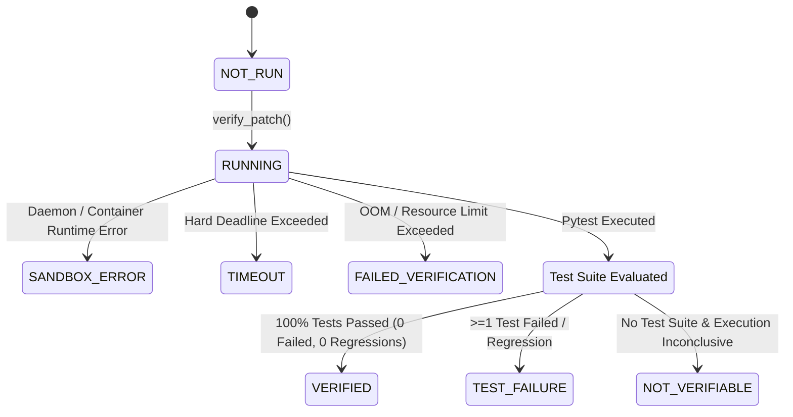

# Docker Sandbox Secure Execution Architecture

## 1. Overview & Security Philosophy

NeuroDebug isolates all user-submitted Python code, LLM-generated patch candidates, and dynamically generated pytest suites inside ephemeral, hardened Docker sandbox containers.

### Core Security Principles

1. **Zero-Trust Input**: All user code, patches, test harnesses, and inputs are treated as untrusted and potentially adversarial.
2. **Total Network Air-Gap**: Containers are executed with `--network none` to prevent data exfiltration, SSRF, reverse shells, and external network scanning.
3. **Immutability & Ephemerality**: The container root filesystem is mounted strictly read-only (`--read-only`). The only writable location is a non-executable, no-suid in-memory tmpfs mounted at `/tmp` (`--tmpfs /tmp:rw,noexec,nosuid,size=64m`).
4. **Least Privilege & Capability Stripping**: All Linux kernel capabilities are dropped (`--cap-drop ALL`), privilege escalation is blocked (`--security-opt no-new-privileges:true`), and execution runs under a non-root UID/GID (`10001:10001`).
5. **Strict Resource Bounding**: CPU, Memory, PID count, execution runtime, and stdout/stderr buffer sizes are capped to prevent denial of service (DoS), fork bombs, and host resource exhaustion.
6. **Hard Cleanup Guarantee**: Ephemeral host directories and containers are purged deterministically upon completion or timeout via forceful container removal (`docker rm -f`).

---

## 2. Architecture & Trust Boundary

```mermaid
flowchart TD
    subgraph Host ["Host Environment (Trusted)"]
        FastAPI["FastAPI Backend"]
        VE["Verification Engine"]
        EL["ExecutionLayer"]
        TR["PytestRunner"]
        DockerExec["DockerSandboxExecutor"]
        FS_Tmp["Host /tmp/neurodebug_sbx_* (0700)"]
    end

    subgraph DockerDaemon ["Docker Engine (Isolated Daemon)"]
        Daemon["dockerd"]
    end

    subgraph Sandbox ["Ephemeral Sandbox Container (Untrusted)"]
        direction TB
        subgraph ContainerIsolation ["Isolation Layer"]
            NetAirGap["Network: NONE"]
            ReadOnlyFS["Root FS: READ-ONLY"]
            TmpFS["/tmp (tmpfs, noexec, nosuid, 64MB)"]
            CapDrop["Capabilities: ALL DROPPED"]
            NoNewPriv["No-New-Privileges: TRUE"]
            NonRoot["User: UID 10001 (sandboxuser)"]
            PidsLimit["PID Limit: 64"]
            MemLimit["Memory: 256MB (No Swap)"]
            CpuLimit["CPU Limit: 1.0 Core"]
        end
        Workdir["/workspace (Mounted Read-Only Host Temp Dir)"]
        PyRuntime["Python 3.10 Runtime / Pytest 8.3.3"]
    end

    FastAPI --> VE
    VE --> EL
    VE --> TR
    EL --> DockerExec
    TR --> DockerExec
    DockerExec --> FS_Tmp
    DockerExec -->|docker run CLI| Daemon
    Daemon -->|Spawns with Constraints| Sandbox
    FS_Tmp -.->|Read-Only Bind Mount| Workdir
    Sandbox -.->|Stdout / Stderr (Bounded 50KB)| DockerExec
```

---

## 3. Container Hardening Parameters

| Hardening Flag | Value / Setting | Threat Mitigation |
| :--- | :--- | :--- |
| `--network` | `none` | Blocks outbound SSRF, data exfiltration, socket listening, internal port scanning |
| `--read-only` | `true` | Prevents filesystem modification, rootkit installation, container file tampering |
| `--tmpfs` | `/tmp:rw,noexec,nosuid,size=64m` | Provides ephemeral storage for Python runtime while prohibiting binary execution from `/tmp` |
| `--cap-drop` | `ALL` | Strips all 41+ Linux kernel capabilities (e.g. `CAP_NET_RAW`, `CAP_SYS_ADMIN`, `CAP_DAC_OVERRIDE`) |
| `--security-opt` | `no-new-privileges:true` | Prevents `setuid`/`setgid` binaries from escalating privileges |
| `--user` | `10001:10001` (`sandboxuser`) | Runs strictly as an unprivileged non-root user without administrative rights |
| `--pids-limit` | `64` | Prevents process exhaustion and `fork()` bombs |
| `--memory` | `256m` | Prevents host RAM exhaustion; triggers OOM termination cleanly |
| `--memory-swap` | `256m` | Disables swap growth beyond RAM limit |
| `--cpus` | `1.0` | Prevents CPU runaway from infinite loops |
| `-v` | `<host_tmp>:/workspace:ro` | Read-only volume mount containing code and tests; host cannot be modified |
| `-e` | `PYTHONUNBUFFERED=1, PYTHONDONTWRITEBYTECODE=1, PYTHONPATH=/workspace` | Sanitized environment; host secrets and API keys are completely withheld |
| Output Cap | `50 KB (51,200 bytes)` | Prevents memory exhaustion attacks via unbounded stdout/stderr flood |
| Hard Timeout | `5.0s (default, configurable)` | Terminates runaway execution and forces container destruction |

---

## 4. Threat Model & Verification Matrix

The NeuroDebug sandbox includes a dedicated 15-scenario adversarial test suite (`backend/tests/test_sandbox_security.py`):

```mermaid
gantt
    title Adversarial Security Threat Matrix
    dateFormat X
    axisFormat %s

    section Resource Attacks
    Infinite Loop (while True)             :crit, a1, 0, 2
    Sleep Beyond Timeout (time.sleep)     :crit, a2, 0, 2
    Memory Bomb (bytearray allocation)    :crit, a3, 0, 5
    Fork Bomb (os.fork loop)              :crit, a4, 0, 5
    Stdout Flood (> 100KB buffer)         :crit, a5, 0, 2

    section Network Attacks
    Outbound HTTP / Exfiltration          :active, b1, 0, 2
    Internal DB / Localhost Port Scan     :active, b2, 0, 2

    section Filesystem & Privilege Attacks
    Host Credential / Secret Leakage      :active, c1, 0, 1
    Host Source Tree Access (/app, .env)  :active, c2, 0, 1
    Path Traversal (/etc/shadow)          :active, c3, 0, 1
    Non-Root User Identity (UID 10001)    :active, c4, 0, 1
    Read-Only Root Filesystem (/malicious):active, c5, 0, 1
    Docker Socket Access (docker.sock)    :active, c6, 0, 1
    Tmpfs Isolation & Cleanup             :active, c7, 0, 1
    Malicious Pytest Fixture Attack       :active, c8, 0, 3
```



---

## 5. Verification State Machine

Every patch candidate is classified into an unambiguous, machine-readable state based strictly on empirical execution evidence:



### Verification States

- `VERIFIED`: Sandbox execution completed cleanly and 100% of validation tests passed without regression.
- `FAILED_VERIFICATION` / `TEST_FAILURE`: One or more validation tests failed or resource limits were violated.
- `TIMEOUT` / `EXECUTION_TIMEOUT`: Code execution exceeded the strict deadline and the container was killed.
- `SANDBOX_ERROR`: Docker runtime infrastructure error occurred before trustworthy evidence could be gathered.
- `NOT_VERIFIABLE` / `UNVERIFIED`: Patch code executed cleanly but no test suite was provided to prove semantic fix correctness.
- `NOT_RUN`: Patch candidate has not yet undergone verification.

---

## 6. Telemetry & Safe Observability

Sandbox execution telemetry is collected via `backend/utils/logging.py`:

```
Sandbox Telemetry: job_id=neurodebug-sbx-a1b2 status=SUCCESS duration_ms=210.45 exit_code=0 tests=4 passed=4 failed=0 truncated=False timeout=False oom=False
```

All credentials (API keys, Bearer tokens, database connection strings) are sanitized automatically via regex redaction filters before logging.
