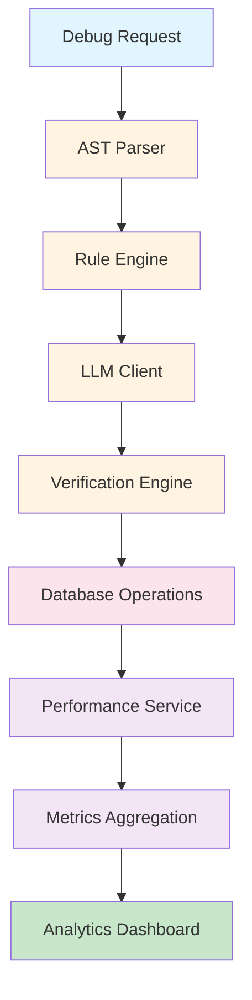

# Performance Metrics Documentation

## Overview

NeuroDebug implements a comprehensive performance metrics engine that tracks timing across all pipeline stages (AST parsing, rule engine, LLM processing, verification, and database operations). This data powers the analytics dashboard and helps identify performance bottlenecks.

## Architecture

### Metrics Flow



## Metrics Tracked

### Pipeline Stages

| Stage | Metric | Description |
|-------|--------|-------------|
| AST Parsing | `ast_duration_ms` | Time to parse code into AST |
| Rule Engine | `rule_duration_ms` | Time to run static rules |
| LLM Processing | `llm_duration_ms` | Time for LLM API calls |
| Verification | `verification_duration_ms` | Time to execute and verify patches |
| Database | `db_duration_ms` | Time for database operations |
| Total Pipeline | `pipeline_duration_ms` | Total end-to-end time |

### Additional Metrics

- **Confidence Score**: LLM confidence in the fix (0.0-1.0)
- **Success Rate**: Percentage of successful verifications
- **Error Count**: Number of errors encountered
- **Request Count**: Total requests per user/session

## Performance Service API

### Context Manager Usage

```python
from backend.services.performance_service import performance_service, PerformanceStage

async def debug_pipeline(code: str):
    with performance_service.track_stage(PerformanceStage.AST):
        ast_result = parse_ast(code)
    
    with performance_service.track_stage(PerformanceStage.RULE):
        rule_violations = run_rules(ast_result)
    
    with performance_service.track_stage(PerformanceStage.LLM):
        llm_response = call_llm(code, rule_violations)
    
    with performance_service.track_stage(PerformanceStage.VERIFICATION):
        verification = verify_patch(llm_response.patch)
    
    metrics = performance_service.get_current_metrics()
    return metrics
```

### Manual Timing

```python
import time
from backend.services.performance_service import performance_service

start_time = time.time()
# ... operation ...
duration_ms = (time.time() - start_time) * 1000
performance_service.record_metric("custom_operation", duration_ms)
```

### Get Aggregated Metrics

```python
from datetime import datetime, timedelta
from backend.services.performance_service import performance_service

# Get metrics for last 7 days
end_date = datetime.utcnow()
start_date = end_date - timedelta(days=7)

metrics = await performance_service.get_aggregated_metrics(
    user_id="uuid",
    start_date=start_date,
    end_date=end_date
)
```

## Data Model

### PerformanceMetrics

```python
@dataclass
class PerformanceMetrics:
    ast_duration_ms: float
    rule_duration_ms: float
    llm_duration_ms: float
    verification_duration_ms: float
    db_duration_ms: float
    pipeline_duration_ms: float
    confidence_score: float
    success: bool
    error_count: int
    timestamp: datetime
```

### AggregatedMetrics

```python
@dataclass
class AggregatedMetrics:
    total_requests: int
    success_count: int
    success_rate: float
    avg_ast_duration_ms: float
    avg_rule_duration_ms: float
    avg_llm_duration_ms: float
    avg_verification_duration_ms: float
    avg_db_duration_ms: float
    avg_pipeline_duration_ms: float
    avg_confidence_score: float
```

## Analytics Integration

### Analytics API Extension

The analytics API includes performance metrics:

```http
GET /analytics
Authorization: Bearer <access_token>
```

**Response:**
```json
{
  "total_requests": 150,
  "success_rate": 0.87,
  "performance": {
    "avg_ast_duration_ms": 45.2,
    "avg_rule_duration_ms": 23.1,
    "avg_llm_duration_ms": 1250.5,
    "avg_verification_duration_ms": 890.3,
    "avg_db_duration_ms": 15.8,
    "avg_pipeline_duration_ms": 2224.9
  }
}
```

## Dashboard Visualization

### Performance Timeline

The analytics dashboard displays:
- **Timeline Chart**: Pipeline duration over time
- **Stage Breakdown**: Pie chart of time per stage
- **Trend Analysis**: Line chart showing performance trends
- **Bottleneck Identification**: Highlight slowest stages

### Performance Cards

- **Average Response Time**: Overall pipeline duration
- **Stage Breakdown**: Individual stage timings
- **Success Rate**: Percentage of successful operations
- **Confidence Score**: Average LLM confidence

## Performance Optimization

### Identified Bottlenecks

Based on typical metrics:

1. **LLM Processing** (50-60% of time): 
   - Optimize prompts
   - Use faster models
   - Implement caching

2. **Verification** (30-40% of time):
   - Optimize test execution
   - Parallel verification
   - Timeout tuning

3. **AST Parsing** (5-10% of time):
   - Already optimized
   - Minimal impact

### Optimization Strategies

#### Caching

```python
@cache_response(ttl=1800, key_prefix="ast")
async def parse_ast_cached(code: str):
    return parse_ast(code)
```

#### Parallel Processing

```python
import asyncio

async def parallel_verification(patches: List[dict]):
    tasks = [verify_patch(patch) for patch in patches]
    return await asyncio.gather(*tasks)
```

#### Batch Operations

```python
async def batch_database_operations(items: List[dict]):
    async with database.session() as session:
        await session.execute(insert(items))
```

## Monitoring

### Performance Alerts

Set up alerts for performance degradation:

```python
if avg_pipeline_duration_ms > 5000:
    send_alert("Pipeline performance degraded")
```

### Health Checks

Include performance metrics in health checks:

```python
@app.get("/health")
async def health_check():
    metrics = performance_service.get_recent_metrics()
    return {
        "status": "healthy",
        "avg_response_time": metrics.avg_pipeline_duration_ms
    }
```

## Configuration

### Environment Variables

```bash
# Performance Tracking
PERFORMANCE_TRACKING_ENABLED=true
PERFORMANCE_RETENTION_DAYS=30
PERFORMANCE_SAMPLE_RATE=1.0  # 1.0 = 100%, 0.1 = 10%
```

### Sampling

For high-traffic systems, use sampling:

```python
import random

if random.random() < PERFORMANCE_SAMPLE_RATE:
    performance_service.track_stage(stage)
```

## Troubleshooting

### Common Issues

**High LLM duration:**
- Check LLM API latency
- Verify prompt complexity
- Consider model selection

**High verification duration:**
- Check test complexity
- Verify timeout settings
- Optimize test execution

**High database duration:**
- Check query performance
- Verify indexing
- Consider connection pooling

## Best Practices

### When to Track Metrics

- **Always track**: Production requests
- **Sample**: Development/staging (reduce overhead)
- **Disable**: Performance testing (avoid noise)

### Data Retention

- **Production**: 30-90 days
- **Development**: 7-30 days
- **Testing**: 1-7 days

### Privacy Considerations

- Don't track sensitive data in metrics
- Aggregate metrics before storage
- Anonymize user identifiers

## Future Enhancements

- [ ] Real-time performance monitoring
- [ ] Performance anomaly detection
- [ ] Automatic performance optimization suggestions
- [ ] Distributed tracing integration
- [ ] Performance budget enforcement
