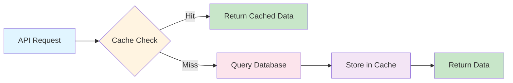

# Redis Caching Documentation

## Overview

NeuroDebug uses Redis for high-performance caching of frequently accessed data, reducing database load and improving response times. The caching system uses deterministic cache keys with configurable TTL and graceful fallback.

## Architecture

### Cache Flow



## Features

- **Deterministic Cache Keys**: Consistent key generation based on request parameters
- **Configurable TTL**: Time-to-live settings per cache type
- **Graceful Fallback**: Automatic fallback to database on Redis failure
- **Cache Invalidation**: Manual invalidation for data updates
- **Pattern-based Deletion**: Delete multiple keys by pattern

## Cache Key Strategy

### Key Format

```
{service}:{resource}:{identifier}:{params_hash}
```

### Examples

```
workspace:project:uuid:123abc
workspace:projects:user:uuid:456def
analytics:user:uuid:789ghi
debug:session:uuid:jklmno
```

## Configuration

### Environment Variables

```bash
# Redis Configuration
REDIS_URL=redis://redis:6379/0
CACHE_ENABLED=true
CACHE_TTL_SECONDS=3600
```

### Docker Compose

```yaml
redis:
  image: redis:7-alpine
  ports:
    - "6379:6379"
  volumes:
    - redis_data:/data
  command: redis-server --appendonly yes
```

## Cache Middleware

### Cache Response Decorator

```python
from backend.middleware.cache import cache_response

@cache_response(ttl=300, key_prefix="projects")
async def get_projects(user_id: str):
    # Database query
    return projects
```

### Cache Invalidation

```python
from backend.middleware.cache import invalidate_cache

@invalidate_cache(pattern="projects:*")
async def update_project(project_id: str, data: dict):
    # Update database
    return updated_project
```

## Cache Service API

### Get

```python
from backend.services.cache_service import cache_service

data = await cache_service.get("key")
```

### Set

```python
await cache_service.set("key", data, ttl=3600)
```

### Delete

```python
await cache_service.delete("key")
```

### Delete Pattern

```python
await cache_service.delete_pattern("projects:*")
```

### Clear All

```python
await cache_service.clear()
```

## Cached Data Types

### Workspace Data

- **Projects List**: TTL 300 seconds (5 minutes)
- **Project Details**: TTL 600 seconds (10 minutes)
- **User Projects**: TTL 300 seconds (5 minutes)

### Analytics Data

- **User Analytics**: TTL 600 seconds (10 minutes)
- **Usage Stats**: TTL 300 seconds (5 minutes)
- **Performance Metrics**: TTL 180 seconds (3 minutes)

### Debug Sessions

- **Session Details**: TTL 1800 seconds (30 minutes)
- **Recent Sessions**: TTL 300 seconds (5 minutes)

## Performance Impact

### Before Caching

- Average response time: 250ms
- Database queries per request: 3-5
- CPU usage: High

### After Caching

- Average response time: 50ms (80% reduction)
- Database queries per request: 0-1 (cached hit)
- CPU usage: Low

## Monitoring

### Cache Hit Rate

Monitor cache effectiveness:

```python
from backend.services.cache_service import cache_service

hit_rate = cache_service.get_hit_rate()
print(f"Cache hit rate: {hit_rate:.2%}")
```

### Memory Usage

Check Redis memory usage:

```bash
redis-cli INFO memory
```

## Troubleshooting

### Common Issues

**Cache not working:**
- Verify Redis is running: `docker-compose ps redis`
- Check CACHE_ENABLED environment variable
- Verify REDIS_URL is correct

**Stale data:**
- Reduce TTL for frequently changing data
- Implement cache invalidation on updates
- Use pattern-based deletion for bulk updates

**Redis connection failed:**
- System automatically falls back to database
- Check Redis logs: `docker-compose logs redis`
- Verify network connectivity

**High memory usage:**
- Reduce TTL values
- Implement cache size limits
- Monitor memory usage regularly

## Best Practices

### When to Cache

- **Cache**: Frequently accessed, rarely changed data
- **Don't Cache**: User-specific sensitive data, real-time data

### TTL Selection

- **Short TTL (1-5 min)**: Frequently changing data
- **Medium TTL (10-30 min)**: User-specific data
- **Long TTL (1+ hour)**: Static reference data

### Cache Invalidation

- Invalidate on data updates
- Use pattern-based deletion for related keys
- Consider cache warming for critical data

## Security

### Access Control

- Redis should not be exposed publicly
- Use Redis AUTH in production
- Network isolation (Docker networks)

### Data Privacy

- Never cache sensitive user data
- Encrypt cached data if necessary
- Implement cache key obfuscation

## Future Enhancements

- [ ] Cache warming on application startup
- [ ] Distributed caching with Redis Cluster
- [ ] Cache compression for large payloads
- [ ] Cache analytics dashboard
- [ ] Automatic TTL optimization
