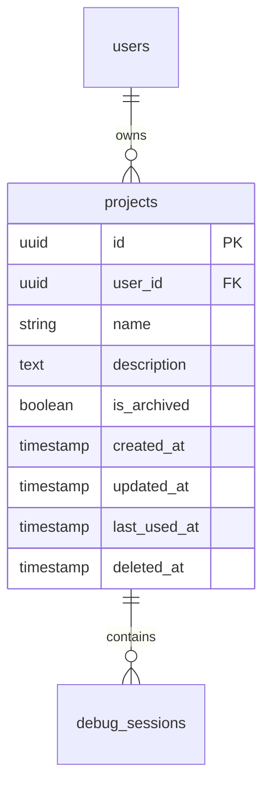

# Workspace Documentation

## Overview

The workspace system provides project management capabilities for organizing debugging sessions. Users can create, rename, archive, delete, and restore projects.

## Architecture

### Database Schema



## Features

- **Project CRUD Operations**: Create, read, update, delete projects
- **Soft Delete**: Projects are soft deleted with `deleted_at` timestamp
- **Archiving**: Archive projects to hide from active view
- **Session Association**: Debug sessions can be linked to projects
- **Usage Tracking**: Track when projects were last used

## API Endpoints

### List Projects

```http
GET /workspace/projects
Authorization: Bearer <access_token>
```

**Response:**
```json
{
  "projects": [
    {
      "id": "uuid",
      "name": "API Integration",
      "description": "Debugging API endpoints",
      "is_archived": false,
      "created_at": "2024-01-01T00:00:00Z",
      "updated_at": "2024-01-01T00:00:00Z",
      "last_used_at": "2024-01-01T00:00:00Z",
      "session_count": 5
    }
  ]
}
```

### Create Project

```http
POST /workspace/projects
Authorization: Bearer <access_token>
Content-Type: application/json

{
  "name": "New Project",
  "description": "Project description"
}
```

**Response:**
```json
{
  "id": "uuid",
  "name": "New Project",
  "description": "Project description",
  "is_archived": false,
  "created_at": "2024-01-01T00:00:00Z",
  "updated_at": "2024-01-01T00:00:00Z"
}
```

### Update Project

```http
PUT /workspace/projects/{project_id}
Authorization: Bearer <access_token>
Content-Type: application/json

{
  "name": "Updated Name",
  "description": "Updated description"
}
```

**Response:**
```json
{
  "id": "uuid",
  "name": "Updated Name",
  "description": "Updated description",
  "is_archived": false,
  "updated_at": "2024-01-01T00:00:00Z"
}
```

### Archive Project

```http
POST /workspace/projects/{project_id}/archive
Authorization: Bearer <access_token>
```

**Response:**
```json
{
  "message": "Project archived successfully"
}
```

### Restore Project

```http
POST /workspace/projects/{project_id}/restore
Authorization: Bearer <access_token>
```

**Response:**
```json
{
  "message": "Project restored successfully"
}
```

### Delete Project

```http
DELETE /workspace/projects/{project_id}
Authorization: Bearer <access_token>
```

**Response:**
```json
{
  "message": "Project deleted successfully"
}
```

## Frontend Integration

### Workspace Service

```javascript
import workspaceService from '../services/workspaceService'

// List projects
const projects = await workspaceService.getProjects()

// Create project
const project = await workspaceService.createProject('Project Name', 'Description')

// Update project
await workspaceService.updateProject(projectId, 'New Name', 'New Description')

// Archive project
await workspaceService.archiveProject(projectId)

// Restore project
await workspaceService.restoreProject(projectId)

// Delete project
await workspaceService.deleteProject(projectId)
```

### Projects Component

The `Projects` component provides a full UI for workspace management:

```javascript
import Projects from '../components/Projects'

function WorkspacePage() {
  return <Projects />
}
```

## Usage Limits

### Subscription-Based Limits

| Tier | Max Projects | Archived Projects |
|------|--------------|-------------------|
| Guest | 0 | 0 |
| Free | 3 | Unlimited |
| Pro | Unlimited | Unlimited |
| Enterprise | Unlimited | Unlimited |

## Best Practices

### Project Organization

1. **Group by Feature**: Create projects for different features or modules
2. **Descriptive Names**: Use clear, descriptive project names
3. **Regular Cleanup**: Archive or delete unused projects
4. **Session Association**: Link debug sessions to relevant projects

### Archiving vs Deleting

- **Archive**: Hide from view but keep data (reversible)
- **Delete**: Soft delete with potential for restoration
- **Permanent Delete**: Hard delete after retention period (not implemented)

## Troubleshooting

### Common Issues

**Cannot create more projects:**
- Check subscription tier limits
- Consider archiving old projects

**Project not showing in list:**
- Check if project is archived
- Verify user ownership

**Cannot restore archived project:**
- Ensure user has permission
- Check if project was permanently deleted

## Configuration

### Environment Variables

```bash
# Project Limits
DEFAULT_GUEST_PROJECTS=0
DEFAULT_FREE_PROJECTS=3
DEFAULT_PRO_PROJECTS=-1  # Unlimited
```

## Future Enhancements

- [ ] Project sharing between users
- [ ] Project templates
- [ ] Project tags and categories
- [ ] Project collaboration features
- [ ] Project export/import
